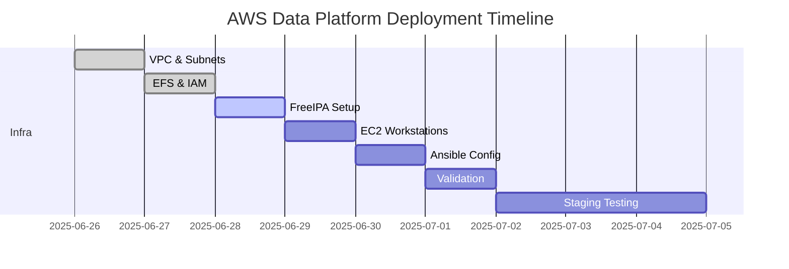

# AWS Data Platform Foundation

---

## Platform Overview

<details>
<summary>Comprehensive Design and Objectives for AWS Data Platform</summary>

---

- **Purpose**: Establish a production-ready AWS data platform to support 20-30 data engineers for big data analytics, machine learning (ML) pipeline development, internal data sharing, and integration with business intelligence (BI) and AI systems.
- **Business Use Cases**:
  - Enable rapid data analysis for business insights, ML model training, and reporting.
  - Support secure collaboration on datasets and scripts among team members.
  - Ensure compliance with enterprise standards (SOC2, ISO 27001, GDPR).
- **Technical Constraints**:
  - No manual AWS Console operations; all infrastructure must be deployed via Infrastructure as Code (IaC) using Terraform and Ansible.
  - Must ensure scalability, high availability (HA), disaster recovery (DR), and enterprise-grade security.
- **Design Decisions**:
  - Use FreeIPA for centralized user authentication and role-based access control (RBAC), integrated with AWS IAM for secure access.
  - Deploy Amazon EFS for shared, high-performance storage with multi-AZ availability.
  - Utilize EC2 Auto Scaling Groups to dynamically adjust compute resources based on demand, optimizing costs.
  - Implement Zero Trust security, RBAC, and audit logging for compliance.
- **Target Outcome**: A clear, step-by-step blueprint enabling DevOps engineers to deploy the platform without manual intervention or confusion.
- **Key Components**: EC2 (workstations, FreeIPA, bastion), IAM, EFS, S3, VPC, Terraform, Ansible, CloudWatch, SNS.

#### Platform Requirements

- **User Support**: Support 20-30 concurrent users, each with a private workspace, FreeIPA-based authentication, and granular access controls.
- **Security**: IAM least privilege, FreeIPA RBAC, mandatory MFA, audit logging, and network isolation via VPC.
- **Scalability**: Auto-scaling EC2, multi-AZ EFS, S3 data lake, and modular design for future expansion.
- **Automation**: 100% IaC with Terraform and Ansible, CI/CD integration for deployment, and scripted user onboarding/offboarding.
- **Compliance**: Adhere to SOC2, ISO 27001, GDPR, with audit logs retained for 1 year and automated backups.

---

#### Success Metrics

- **Deployment Clarity**: DevOps can deploy the platform 100% via scripts with zero manual errors.
- **Operational Reliability**: Uptime >99.9%, automatic failover, and regular backup/restore tests.
- **User Accessibility**: Onboarding new users in less than 5 minutes, offboarding in less than 2 minutes, with full audit trails.
- **Security Posture**: No excessive privileges, all access logged, and monthly security reviews.

---

- **Design Rationale**:
  - FreeIPA provides robust user management, integrating seamlessly with EC2, EFS, and AWS IAM.
  - EFS ensures high-throughput, POSIX-compliant storage for collaborative workflows.
  - A dedicated VPC with subnet isolation enhances security and traffic control.
  - CloudWatch and SNS enable proactive monitoring and rapid incident response.

</details>

---

## Infrastructure Architecture

<details>
<summary>Detailed System Components and Integration Patterns</summary>

---

- **Compute Layer**:
  - **EC2 Auto Scaling Group (ASG)** for workstations:
    - Scales from 5 to 30 instances (`t3.medium`, Amazon Linux 2).
    - Pre-installed tools: Python, Docker, Jupyter, VSCode server.
    - On boot, scripts (via Ansible) mount EFS, join FreeIPA domain, and perform health checks.
  - **FreeIPA Server**:
    - 1 master, 1 replica (HA) on `t3.medium` EC2 instances, 100 GB EBS (gp3), CentOS 8.
    - Master in AZ us-east-1a, replica in us-east-1b, daily replication checks via cronjob.
    - Nightly LDAP backups to S3 with versioning.
  - **Bastion Host**:
    - `t3.micro`, Amazon Linux 2, in public subnet.
    - SSH access restricted to company IPs, audited via CloudWatch Logs.
    - Hardened with fail2ban and CloudWatch Agent for centralized logging.
  - **Operational Notes**: Monitor ASG health via CloudWatch. If an EC2 fails, ASG auto-replaces it; Ansible re-runs join-domain and EFS-mount scripts.

- **Storage Layer**:
  - **Amazon EFS**:
    - General Purpose mode, multi-AZ, provisioned throughput (10 MB/s baseline).
    - Mount targets in each private subnet, encrypted at rest.
    - Access points for POSIX permissions per user/group, audit logs for mount/unmount.
  - **Amazon S3**:
    - Data lake buckets (raw, processed, backup), versioning enabled.
    - Lifecycle policies: Move to Glacier after 90 days, delete after 1 year.
    - S3 event notifications to SNS for file creation/deletion.
  - **EBS**:
    - 50 GB gp3 per EC2 workstation, weekly snapshots, monthly restore tests.
  - **Risks & Mitigation**:
    - EFS failure: Failover to backup or restore from AWS Backup snapshot.
    - S3 data loss: Versioning prevents accidental deletion; lifecycle policies manage costs.

- **Networking**:
  - **VPC**:
    - CIDR: 10.0.0.0/16.
    - 2 private subnets (10.0.1.0/24, 10.0.2.0/24) for EC2, EFS, FreeIPA.
    - 1 public subnet (10.0.0.0/24) for bastion and NAT Gateway.
  - **NAT Gateway**: Outbound internet access for private subnets.
  - **Security Groups**:
    - EC2 Workstations: Allow SSH (port 22) from bastion, NFS (port 2049) to EFS, LDAP (port 389/636) to FreeIPA.
    - FreeIPA: Allow LDAP (389/636), Kerberos (88) from EC2.
    - Bastion: Allow SSH (22) from company IPs only.
  - **NACLs**: Deny all except required traffic (SSH, NFS, LDAP); log denied traffic.
  - **VPC Flow Logs**: Sent to CloudWatch, retained for 90 days for auditing.
  - **Operational Notes**: Review security group/NACL rules monthly. Use VPC Flow Logs to detect anomalies.

- **Authentication & Authorization**:
  - FreeIPA manages users, groups, and RBAC. Scripts automate user creation, group assignment, and EFS home directory setup.
  - IAM roles mapped to FreeIPA groups via SAML, mandatory MFA for all users, 8-hour session timeout.
  - SSO support for LDAP integration (e.g., Okta, AWS SSO).
  - **Risks & Mitigation**: FreeIPA outage mitigated by replica and nightly LDAP backups to S3.

- **Monitoring & Logging**:
  - **CloudWatch**:
    - Metrics: EC2 CPU, RAM, disk; EFS throughput, IOPS; FreeIPA health (custom metrics).
    - Dashboards: Separate views for compute, storage, network, and authentication.
  - **SNS**: Alerts for EC2 failures, EFS unmounts, FreeIPA replication issues, integrated with Slack/PagerDuty.
  - **Logs**: CloudWatch Logs for EC2, FreeIPA, and audit trails; retained for 1 year.
  - **Operational Notes**: Test alerts weekly, review logs monthly, monitor CloudWatch quota limits.

- **High Availability & Disaster Recovery**:
  - **HA**: FreeIPA replica in separate AZ, EFS multi-AZ, EC2 ASG across AZs.
  - **DR**: Backups in S3 (cross-region), Terraform redeployment scripts, DNS updates. Quarterly DR drills with documented checklist.
  - **Risks & Mitigation**: Region-wide failure mitigated by cross-region S3 backups and tested restore procedures.

- **Performance Optimization**:
  - EC2: `t3.medium` with T3 Unlimited, ENA, and SR-IOV enabled.
  - EFS: Optimized mount options (rsize=1048576,wsize=1048576) for data workloads.
  - CloudWatch monitors EFS burst credits; increase throughput if needed.
  - **Operational Notes**: Review EC2/EFS performance monthly, adjust instance types or throughput as needed.

- **Integration Patterns**:
  - FreeIPA integrates with Dask, Metaflow, Airflow via LDAP/Kerberos.
  - EFS mounted on EC2 via Ansible, mount status checked hourly via cronjob.
  - IAM policies enforce tag-based access (e.g., `Environment=data-platform`).

- **Design Justification**:
  - Ensures scalability, security, and compliance for enterprise data workloads.
  - Cost-optimized via auto-scaling and lifecycle policies.
  - Simplifies operations with IaC and automated monitoring.

---

#### System Architecture Diagram

**Text-Based Description** (for clarity, as graphical tools are unavailable):
- **VPC (10.0.0.0/16)**:
  - **Public Subnet (10.0.0.0/24, us-east-1a)**:
    - Bastion Host (`t3.micro`): SSH access (port 22) from company IPs.
    - NAT Gateway: Outbound internet for private subnets.
  - **Private Subnet 1 (10.0.1.0/24, us-east-1a)**:
    - EC2 Workstations (ASG, `t3.medium`): Connect to EFS (port 2049), FreeIPA (ports 389/636, 88).
    - FreeIPA Master (`t3.medium`): LDAP/Kerberos services.
    - EFS Mount Target: Encrypted, multi-AZ.
  - **Private Subnet 2 (10.0.2.0/24, us-east-1b)**:
    - EC2 Workstations (ASG, `t3.medium`): Same connections as Subnet 1.
    - FreeIPA Replica (`t3.medium`): HA for FreeIPA.
    - EFS Mount Target: Same as Subnet 1.
- **Data Flows**:
  - Users SSH to bastion, then to EC2 Workstations.
  - EC2 mounts EFS for shared storage.
  - EC2 authenticates with FreeIPA for user login.
  - S3 accessed via IAM roles for data lake operations.
- **Security**:
  - Security Groups restrict traffic to required ports.
  - VPC Flow Logs monitor all traffic for anomalies.

**Note**: DevOps can use AWS Architecture Icons or Draw.io to create a visual diagram based on this description, including ports and data flows.

---

#### Component-Function Mapping Table

| Component         | Main Function                                   | Operational Notes / Risk Mitigation             |
|-------------------|-------------------------------------------------|-------------------------------------------------|
| EC2 Workstation   | User workspace, pre-installed tools             | Auto-scaling, Ansible for domain join/EFS mount |
| FreeIPA           | User/group RBAC, IAM integration                | Replica in separate AZ, nightly LDAP backups    |
| Bastion Host      | Secure SSH gateway                              | Restrict to company IPs, fail2ban, audit logs   |
| EFS               | Shared storage, multi-AZ, backups               | Access points, audit logs, restore tests        |
| S3                | Data lake, backups, audit logs                  | Versioning, lifecycle policies, SNS alerts      |
| VPC/Subnet        | Network isolation, secure traffic               | Monthly rule reviews, VPC Flow Logs             |
| Security Group    | Network access control                          | Tag-based rules, monthly audits                 |
| CloudWatch/SNS    | Monitoring, alerting, logging                   | Weekly alert tests, 1-year log retention        |

</details>

---

## Access Control Design

<details>
<summary>Comprehensive Authentication, RBAC, and Security Controls</summary>

---

- **Authentication**: FreeIPA (on EC2) manages user credentials, groups, and SSH keys. Mandatory MFA (TOTP/SMS) for all users.
- **Authorization**: IAM roles assigned via FreeIPA groups, enforcing least privilege.
- **Access Policies**:
  - `data_engineer`: Read/write EFS, read/write specific S3 buckets, execute on EC2.
  - `platform_admin`: Full EC2/EFS/IAM management, restricted to us-east-1.
  - `contractor`: Limited EFS/S3 read access, 2-hour session timeout.

#### Comprehensive Authentication Architecture

- **FreeIPA Server Deployment**:
  - **Instance**: `t3.medium`, 100 GB EBS (gp3), CentOS 8.
  - **Domain**: `ipa.dataplatform.local`.
  - **SSL**: Let’s Encrypt with auto-renewal via cronjob.
  - **HA**: Master in us-east-1a, replica in us-east-1b, daily replication checks.
- **User Management Workflow**:
  ```python
  # FreeIPA user provisioning script
  import ipalib
  from ipalib import api

  class UserProvisioning:
      def __init__(self):
          api.bootstrap(context='client')
          api.finalize()
          api.Backend.rpcclient.connect()

      def create_user(self, username, first_name, last_name, email, groups):
          """Create user with MFA and group assignments"""
          try:
              api.Command.user_add(
                  username,
                  givenname=first_name,
                  sn=last_name,
                  mail=email,
                  userpassword='TempPassword123!',
                  otptoken=True  # Enable TOTP MFA
              )
              for group in groups:
                  api.Command.group_add_member(group, user=[username])
              return f"User {username} created"
          except Exception as e:
              return f"Error: {str(e)}"

      def delete_user(self, username):
          """Offboard user and archive data"""
          try:
              # Disable account
              api.Command.user_disable(username)
              # Archive EFS home directory to S3
              api.Command.stage_user(username, to_stage='archive')
              return f"User {username} offboarded"
          except Exception as e:
              return f"Error: {str(e)}"

      def create_service_account(self, service_name, description):
          """Create service account"""
          try:
              api.Command.user_add(
                  service_name,
                  givenname='Service',
                  sn='Account',
                  mail=f'{service_name}@dataplatform.local',
                  nsaccountlock=False,
                  description=description
              )
              api.Command.service_add(f'{service_name}/dataplatform.local')
              return f"Service account {service_name} created"
          except Exception as e:
              return f"Error: {str(e)}"
  ```
- **LDAP Integration**:
  ```yaml
  # LDAP configuration for AWS SSO
  LDAPSettings:
    ServerURL: "ldaps://ipa.dataplatform.local:636"
    BaseDN: "dc=dataplatform,dc=local"
    BindDN: "uid=ldapbind,cn=users,dc=dataplatform,dc=local"
    UserSearchBase: "cn=users,dc=dataplatform,dc=local"
    GroupSearchBase: "cn=groups,dc=dataplatform,dc=local"
    AttributeMapping:
      Username: "uid"
      Email: "mail"
      FirstName: "givenName"
      LastName: "sn"
      Groups: "memberOf"
    SecuritySettings:
      RequireSSL: true
      CertificateValidation: true
      EncryptionMethod: "TLS"
      AuthenticationMethod: "Simple"
  ```

#### Role-Based Access Control (RBAC) Implementation

- **User Group Hierarchy**:
  - `data_engineers`: Data processing and analytics.
  - `data_scientists`: ML model development.
  - `platform_admins`: Infrastructure management.
  - `security_auditors`: Read-only for compliance.
  - `contractors`: Limited, time-bound access.
- **IAM Role Definitions**:
  ```json
  {
    "DataEngineerRole": {
      "Version": "2012-10-17",
      "Statement": [
        {
          "Effect": "Allow",
          "Action": [
            "ec2:DescribeInstances",
            "ec2:StartInstances",
            "ec2:StopInstances",
            "ec2:RebootInstances"
          ],
          "Resource": "*",
          "Condition": {
            "StringEquals": {
              "ec2:ResourceTag/Environment": "data-platform"
            }
          }
        },
        {
          "Effect": "Allow",
          "Action": [
            "s3:GetObject",
            "s3:PutObject",
            "s3:DeleteObject",
            "s3:ListBucket"
          ],
          "Resource": [
            "arn:aws:s3:::data-platform-raw/*",
            "arn:aws:s3:::data-platform-processed/*",
            "arn:aws:s3:::data-platform-raw",
            "arn:aws:s3:::data-platform-processed"
          ]
        },
        {
          "Effect": "Allow",
          "Action": [
            "elasticfilesystem:ClientMount",
            "elasticfilesystem:ClientWrite",
            "elasticfilesystem:ClientRootAccess"
          ],
          "Resource": "*",
          "Condition": {
            "StringEquals": {
              "elasticfilesystem:AccessedViaMountTarget": "true"
            }
          }
        }
      ]
    },
    "PlatformAdminRole": {
      "Version": "2012-10-17",
      "Statement": [
        {
          "Effect": "Allow",
          "Action": [
            "ec2:*",
            "efs:*",
            "s3:*",
            "iam:*",
            "cloudwatch:*",
            "logs:*"
          ],
          "Resource": "*",
          "Condition": {
            "StringEquals": {
              "aws:RequestedRegion": "us-east-1"
            }
          }
        }
      ]
    }
  }
  ```
- **Session Management and MFA**:
  ```python
  class MFAEnforcement:
      def __init__(self):
          self.session_timeout = 28800  # 8 hours
          self.mfa_methods = ['TOTP', 'SMS']

      def enforce_mfa_policy(self, user_group):
          """Enforce MFA for all groups"""
          mfa_policy = {
              'platform_admins': {
                  'required': True,
                  'methods': ['TOTP'],
                  'session_timeout': 14400  # 4 hours
              },
              'data_engineers': {
                  'required': True,
                  'methods': ['TOTP', 'SMS'],
                  'session_timeout': 28800
              },
              'data_scientists': {
                  'required': True,
                  'methods': ['TOTP', 'SMS'],
                  'session_timeout': 28800
              },
              'contractors': {
                  'required': True,
                  'methods': ['TOTP'],
                  'session_timeout': 7200  # 2 hours
              }
          }
          return mfa_policy.get(user_group, {
              'required': True,
              'methods': ['TOTP'],
              'session_timeout': 3600
          })
  ```

#### Advanced Security Controls

- **Zero Trust**:
  - Every transaction authenticated and authorized.
  - Continuous monitoring of user/device behavior via CloudWatch.
- **Privileged Access Management (PAM)**:
  ```yaml
  PAMConfiguration:
    PasswordPolicy:
      MinLength: 14
      RequireUppercase: true
      RequireLowercase: true
      RequireNumbers: true
      RequireSpecialChars: true
      PasswordHistory: 12
      MaxAge: 90
    AccessControls:
      SudoAccess:
        - Group: "platform_admins"
          Commands: "ALL"
          Authentication: "required"
          Logging: "enabled"
        - Group: "data_engineers"
          Commands: "/usr/bin/systemctl restart docker, /usr/bin/mount"
          Authentication: "required"
          Logging: "enabled"
      SSHAccess:
        AllowGroups: ["data_engineers", "platform_admins"]
        DenyUsers: ["root"]
        MaxSessions: 5
        LoginGraceTime: 60
    AuditingRules:
      - Event: "sudo_command"
        LogFile: "/var/log/sudo.log"
        RemoteLogging: "enabled"
      - Event: "ssh_login"
        LogFile: "/var/log/secure"
        RemoteLogging: "enabled"
  ```
- **Certificate Management**:
  ```bash
  #!/bin/bash
  # SSL certificate automation
  deploy_certificates() {
      local domain="$1"
      local service="$2"
      certbot certonly \
          --dns-route53 \
          --dns-route53-propagation-seconds 30 \
          -d "$domain" \
          --non-interactive \
          --agree-tos \
          --email admin@dataplatform.local
      case "$service" in
          "freeipa")
              cp "/etc/letsencrypt/live/$domain/fullchain.pem" \
                 "/etc/pki/tls/certs/server.crt"
              cp "/etc/letsencrypt/live/$domain/privkey.pem" \
                 "/etc/pki/tls/private/server.key"
              systemctl restart ipa
              ;;
      esac
      echo "Certificate deployed for $domain on $service"
  }
  setup_auto_renewal() {
      echo "0 12 * * * root certbot renew --quiet --post-hook 'systemctl restart ipa'" > /etc/cron.d/certbot-renewal
      echo "Auto-renewal configured"
  }
  ```

#### Compliance and Audit Framework

- **Compliance**: SOC2 Type II, ISO 27001, GDPR.
- **Audit Logging**:
  ```python
  import json
  import boto3
  from datetime import datetime

  class AuditLogger:
      def __init__(self):
          self.cloudtrail = boto3.client('cloudtrail')
          self.cloudwatch = boto3.client('cloudwatch')
          self.s3 = boto3.client('s3')

      def log_user_action(self, user_id, action, resource, details=None):
          """Log user actions for audit trail"""
          audit_event = {
              'timestamp': datetime.utcnow().isoformat(),
              'user_id': user_id,
              'action': action,
              'resource': resource,
              'source_ip': self.get_source_ip(),
              'details': details or {}
          }
          self.send_to_cloudwatch(audit_event)
          self.store_in_s3(audit_event, bucket='data-platform-audit')
          return audit_event

      def generate_compliance_report(self, start_date, end_date):
          """Generate quarterly compliance report"""
          events = self.query_audit_events(start_date, end_date)
          report = {
              'report_period': f"{start_date} to {end_date}",
              'total_events': len(events),
              'user_statistics': self.calculate_user_stats(events),
              'security_events': self.filter_security_events(events)
          }
          self.store_in_s3(report, bucket='data-platform-compliance')
          return report
  ```

- **Security Reviews**:
  - Monthly IAM policy audits using AWS IAM Access Analyzer.
  - Quarterly compliance reports shared with business stakeholders.
  - Weekly log reviews for anomalies (e.g., unusual logins).

</details>

---

## Infrastructure as Code (IaC) Strategy

<details>
<summary>Terraform & Ansible Automation Plans</summary>

---

#### Terraform Configuration Plans

- **Module Structure**:
  ```
  terraform/
  ├── modules/
  │   ├── vpc/
  │   ├── ec2/
  │   ├── efs/
  │   ├── iam/
  │   ├── freeipa/
  │   ├── security/
  ├── environments/
  │   ├── prod/
  │       ├── main.tf
  │       ├── variables.tf
  │       ├── outputs.tf
  ├── state/
  │   ├── backend.tf
  ```
- **Example Modules**:
  ```hcl
  # modules/vpc/main.tf
  resource "aws_vpc" "main" {
    cidr_block = var.cidr_block
    tags = { Name = "data-platform-vpc" }
  }
  resource "aws_subnet" "private" {
    count = length(var.private_subnet_cidrs)
    vpc_id = aws_vpc.main.id
    cidr_block = var.private_subnet_cidrs[count.index]
    availability_zone = var.availability_zones[count.index]
    tags = { Name = "private-subnet-${count.index}" }
  }
  resource "aws_subnet" "public" {
    vpc_id = aws_vpc.main.id
    cidr_block = var.public_subnet_cidr
    availability_zone = var.availability_zones[0]
    tags = { Name = "public-subnet" }
  }

  # modules/efs/main.tf
  resource "aws_efs_file_system" "main" {
    creation_token = "data-platform-efs"
    performance_mode = var.performance_mode
    encrypted = true
    tags = { Name = "data-platform-efs" }
  }
  resource "aws_efs_mount_target" "main" {
    count = length(var.subnet_ids)
    file_system_id = aws_efs_file_system.main.id
    subnet_id = var.subnet_ids[count.index]
    security_groups = [var.security_group_id]
  }

  # modules/ec2/main.tf
  resource "aws_launch_template" "workstation" {
    name_prefix = "data-platform-workstation"
    image_id = var.ami_id
    instance_type = "t3.medium"
    vpc_security_group_ids = [var.security_group_id]
    user_data = base64encode(<<-EOF
      #!/bin/bash
      yum update -y
      systemctl enable cloudwatch-agent
      EOF
    )
  }
  resource "aws_autoscaling_group" "workstation" {
    min_size = 5
    max_size = 30
    desired_capacity = 10
    vpc_zone_identifier = var.subnet_ids
    launch_template {
      id = aws_launch_template.workstation.id
      version = "$Latest"
    }
    tag {
      key = "Environment"
      value = "data-platform"
      propagate_at_launch = true
    }
  }

  # modules/iam/main.tf
  resource "aws_iam_role" "data_engineer" {
    name = "DataEngineerRole"
    assume_role_policy = jsonencode({
      Version = "2012-10-17"
      Statement = [{
        Effect = "Allow"
        Principal = { Federated = "arn:aws:iam::${var.account_id}:saml-provider/freeipa" }
        Action = "sts:AssumeRoleWithSAML"
        Condition = { StringEquals = { "SAML:aud" = "https://signin.aws.amazon.com/saml" } }
      }]
    })
  }
  resource "aws_iam_role_policy" "data_engineer" {
    role = aws_iam_role.data_engineer.id
    policy = jsonencode({
      Version = "2012-10-17"
      Statement = [
        {
          Effect = "Allow"
          Action: ["s3:GetObject", "s3:PutObject", "s3:ListBucket"]
          Resource: ["arn:aws:s3:::data-platform-*"]
        },
        {
          Effect = "Allow"
          Action: ["elasticfilesystem:ClientMount", "elasticfilesystem:ClientWrite"]
          Resource: "*"
        }
      ]
    })
  }

  # modules/freeipa/main.tf
  resource "aws_instance" "freeipa" {
    ami = var.centos_ami
    instance_type = "t3.medium"
    subnet_id = var.subnet_id
    vpc_security_group_ids = [var.security_group_id]
    ebs_block_device {
      device_name = "/dev/sda1"
      volume_size = 100
      volume_type = "gp3"
    }
    tags = { Name = "freeipa-${var.role}" }
  }
  ```
- **State Management**:
  ```hcl
  # state/backend.tf
  terraform {
    backend "s3" {
      bucket = "data-platform-terraform-state"
      key = "prod/terraform.tfstate"
      region = "us-east-1"
      dynamodb_table = "terraform-locks"
    }
  }
  ```
- **Secrets Management**:
  - Store sensitive variables (e.g., FreeIPA admin password) in AWS Secrets Manager.
  - Example:
    ```hcl
    data "aws_secretsmanager_secret_version" "freeipa_password" {
      secret_id = "freeipa/admin-password"
    }
    ```
- **Error Handling**:
  - Check AWS quotas (e.g., EC2 instances, EFS throughput) before `terraform apply`.
  - Use `terraform plan` to preview changes.
  - If state conflicts occur, run `terraform refresh` or restore from S3 backup.
  - Log errors to CloudWatch for debugging.

#### Ansible Playbook Strategy

- **Playbook Structure**:
  ```
  ansible/
  ├── roles/
  │   ├── freeipa-client/
  │   ├── efs-mount/
  │   ├── tools-install/
  │   ├── security-harden/
  ├── playbooks/
  │   ├── configure-ec2.yml
  │   ├── update-ec2.yml
  ├── inventory/
  │   ├── prod.yml
  ```
- **Example Playbooks**:
  ```yaml
  # playbooks/configure-ec2.yml
  - hosts: workstations
    become: true
    roles:
      - freeipa-client
      - efs-mount
      - tools-install
      - security-harden

  # roles/freeipa-client/tasks/main.yml
  - name: Install FreeIPA client
    yum:
      name: ipa-client
      state: present
  - name: Join FreeIPA domain
    command: ipa-client-install --domain=ipa.dataplatform.local --server=ipa-master.dataplatform.local --mkhomedir --force-join
    args:
      creates: /etc/ipa/default.conf

  # roles/efs-mount/tasks/main.yml
  - name: Install NFS utilities
    yum:
      name: nfs-utils
      state: present
  - name: Create EFS mount point
    file:
      path: /data
      state: directory
  - name: Mount EFS
    mount:
      src: "{{ efs_dns }}:/"
      path: /data
      fstype: nfs4
      opts: "_netdev,tls,rsize=1048576,wsize=1048576"
      state: mounted

  # roles/tools-install/tasks/main.yml
  - name: Install Python and tools
    yum:
      name: "{{ packages }}"
      state: present
    vars:
      packages:
        - python3
        - docker
        - jupyter
  - name: Install VSCode server
    shell: curl -fsSL https://code-server.dev/install.sh | sh

  # roles/security-harden/tasks/main.yml
  - name: Disable root SSH login
    lineinfile:
      path: /etc/ssh/sshd_config
      regexp: '^PermitRootLogin'
      line: 'PermitRootLogin no'
      state: present
    notify: restart sshd
  - name: Enable firewalld
    service:
      name: firewalld
      state: started
      enabled: true
  ```
- **Execution Guide**:
  - Inventory: Define EC2 instances in `inventory/prod.yml` using AWS tags (e.g., `Environment=data-platform`).
  - Run: `ansible-playbook -i inventory/prod.yml playbooks/configure-ec2.yml --vault-password-file vault_pass.txt`.
  - Secrets: Store passwords in Ansible Vault (`ansible-vault encrypt_string`).
- **Error Handling**:
  - Check network connectivity before mounting EFS (`ping efs_dns`).
  - Log errors to `/var/log/ansible.log` and CloudWatch.
  - Retry failed tasks with `--limit @retry` after fixing issues (e.g., FreeIPA server down).

</details>

---

## Deployment & Operations

<details>
<summary>Step-by-Step Deployment & Maintenance Procedures</summary>

---

#### Deployment Chronology

1. **Day 1: Network and Storage Setup** (8 hours)
   - **Task**: Deploy VPC, subnets, route tables, NAT Gateway, and EFS.
   - **Commands**:
     ```bash
     cd terraform/environments/prod
     terraform init
     terraform plan -out=tfplan
     terraform apply tfplan
     ```
   - **Checks**: Verify VPC CIDR, subnet connectivity, EFS mount targets in CloudWatch.

2. **Day 2: IAM and FreeIPA Setup** (8 hours)
   - **Task**: Create IAM roles/policies, deploy FreeIPA master/replica.
   - **Commands**:
     ```bash
     terraform apply -target=module.iam
     terraform apply -target=module.freeipa
     ansible-playbook -i inventory/prod.yml playbooks/freeipa-config.yml
     ```
   - **Checks**: Test IAM role assumption (`aws sts assume-role`), verify FreeIPA replication (`ipa-replica-manage list`).

3. **Day 3: EC2 Workstations Setup** (8 hours)
   - **Task**: Deploy EC2 ASG, configure workstations with Ansible.
   - **Commands**:
     ```bash
     terraform apply -target=module.ec2
     ansible-playbook -i inventory/prod.yml playbooks/configure-ec2.yml
     ```
   - **Checks**: SSH to EC2, verify EFS mount (`df -h`), FreeIPA login (`kinit user`).

4. **Day 4: Validation and Testing** (8 hours)
   - **Task**: Test user onboarding, offboarding, EFS access, IAM permissions, and backups.
   - **Commands**:
     ```bash
     python scripts/user_provisioning.py create_user testuser Test User test@dataplatform.local data_engineers
     aws s3 ls s3://data-platform-raw --profile testuser
     python scripts/user_provisioning.py delete_user testuser
     ```
   - **Checks**: Confirm audit logs in CloudWatch, test EFS restore from AWS Backup.

5. **Day 5-7: Staging Environment Testing** (24 hours)
   - **Task**: Deploy in staging environment, simulate failures (EC2 crash, FreeIPA outage), and validate DR.
   - **Commands**:
     ```bash
     terraform apply -var-file=staging.tfvars
     ansible-playbook -i inventory/staging.yml playbooks/configure-ec2.yml
     ```
   - **Checks**: Verify failover to FreeIPA replica, restore EFS/S3 backups, document results.

**Total Timeline**: 5-7 days, including 3-day staging test.

#### Operational Procedures

- **User Onboarding**:
  - Script: Run `python scripts/user_provisioning.py create_user <username> <first> <last> <email> <groups>`.
  - Steps: Create FreeIPA user, assign IAM role, set up EFS home directory.
  - Time: less than 5 minutes.
- **User Offboarding**:
  - Script: Run `python scripts/user_provisioning.py delete_user <username>`.
  - Steps: Disable FreeIPA account, revoke IAM access, archive EFS data to S3.
  - Time: less than 2 minutes.
- **Backup/Restore**:
  - EFS: Daily AWS Backup job, monthly restore tests (`aws backup start-restore-job`).
  - EC2: Weekly AMI snapshots, quarterly restore tests.
  - FreeIPA: Nightly LDAP export to S3 (`ipa-backup`).
- **Monitoring**:
  - CloudWatch dashboards for EC2, EFS, FreeIPA.
  - SNS alerts for failures, integrated with Slack/PagerDuty.
  - Weekly alert tests: Trigger test events (`aws sns publish`).
- **Security Reviews**:
  - Monthly IAM audits with IAM Access Analyzer.
  - Weekly log reviews for anomalies (`aws logs filter-log-events`).
  - Quarterly compliance reports generated by `AuditLogger.generate_compliance_report`.

#### Runbook: Daily Operations & Incident Response

- **Daily Health Checks**:
  - EC2: Check ASG status (`aws autoscaling describe-auto-scaling-groups`).
  - EFS: Verify mount status (`df -h /data`).
  - FreeIPA: Confirm replication (`ipa-replica-manage list`).
- **Incident Response**:
  - **EC2 Failure**:
    - ASG auto-replaces instance.
    - Run `ansible-playbook playbooks/configure-ec2.yml --limit failed_host`.
    - Time: 10 minutes.
  - **FreeIPA Outage**:
    - Promote replica: `ipa-replica-manage promote`.
    - Update DNS: `aws route53 change-resource-record-sets`.
    - Notify users via SNS.
    - Time: 30 minutes.
  - **EFS Issue**:
    - Check mount: `mount | grep efs`.
    - Restore from backup: `aws backup start-restore-job`.
    - Time: 1 hour.
  - **Security Incident**:
    - Rotate IAM keys: `aws iam update-access-key`.
    - Revoke sessions: `aws sso-admin disable-user`.
    - Review logs: `aws logs filter-log-events --log-group-name /aws/audit`.
    - Time: 1-2 hours.

#### Automation & CI/CD Integration

- **Terraform**:
  - CI/CD pipeline (GitHub Actions):
    ```yaml
    name: Terraform Deploy
    on: [push]
    jobs:
      terraform:
        runs-on: ubuntu-latest
        steps:
          - uses: actions/checkout@v3
          - uses: hashicorp/setup-terraform@v2
          - run: terraform init
          - run: terraform plan -out=tfplan
          - run: terraform apply tfplan
    ```
  - Require PR approval before `terraform apply`.
- **Ansible**:
  - CI/CD pipeline runs playbooks on EC2 tag updates.
  - Use Ansible Vault for secrets (`ansible-vault encrypt_string`).
- **Secrets**:
  - Store in AWS Secrets Manager, access via Terraform/Ansible.
  - Rotate monthly: `aws secretsmanager rotate-secret`.

#### Guide for New DevOps

- **Accessing CloudWatch**:
  - Login to AWS Console, navigate to CloudWatch > Dashboards > data-platform.
  - CLI: `aws cloudwatch get-metric-data --metric-data-queries file://query.json`.
- **Running Terraform**:
  - Initialize: `terraform init`.
  - Plan: `terraform plan -var-file=prod.tfvars`.
  - Apply: `terraform apply`.
- **Running Ansible**:
  - Install: `pip install ansible`.
  - Run: `ansible-playbook -i inventory/prod.yml playbooks/configure-ec2.yml`.
- **Checking Logs**:
  - CloudWatch: `aws logs filter-log-events --log-group-name /aws/audit`.
  - EC2: `tail -f /var/log/ansible.log`.

#### Disaster Recovery Drills

- **Frequency**: Quarterly (next: September 2025).
- **Steps**:
  - Simulate region failure: Stop us-east-1 resources.
  - Redeploy with Terraform: `terraform apply -var-file=dr.tfvars`.
  - Restore EFS/S3: `aws backup start-restore-job`.
  - Update DNS: `aws route53 change-resource-record-sets`.
- **Checklist**:
  - [ ] Verify Terraform deployment.
  - [ ] Test EFS/S3 restore.
  - [ ] Confirm user access post-restore.
  - [ ] Document results in S3 (`data-platform-dr-reports`).

#### Best Practices

- Use immutable AMIs for EC2 (bake with Packer).
- Audit IAM policies monthly with IAM Access Analyzer.
- Require PRs for all Terraform/Ansible changes.
- Document all procedures in a shared Confluence/Wiki.

#### Deployment & Validation Checklist

- [ ] VPC, subnets, route tables created.
- [ ] EFS provisioned, mounted on EC2.
- [ ] FreeIPA deployed, replication tested.
- [ ] IAM roles/policies assigned.
- [ ] EC2 workstations joined to FreeIPA, EFS mounted.
- [ ] Security groups, NACLs, VPC Flow Logs validated.
- [ ] CloudWatch dashboards/alerts configured.
- [ ] Backup/restore tested for EFS, EC2, FreeIPA.
- [ ] User onboarding/offboarding scripts tested.
- [ ] Staging environment deployed and validated.
- [ ] Documentation shared with DevOps team.

</details>

---

## Architecture Diagrams & Timeline

<details>
<summary>System Topology & Project Gantt Chart</summary>

---

#### Infrastructure Architecture Diagram

**Text-Based Description**:
- **VPC (10.0.0.0/16)**:
  - **Public Subnet (10.0.0.0/24, us-east-1a)**:
    - Bastion Host: SSH (port 22) from company IPs.
    - NAT Gateway: Outbound internet.
  - **Private Subnet 1 (10.0.1.0/24, us-east-1a)**:
    - EC2 Workstations: NFS (2049) to EFS, LDAP (389/636) to FreeIPA.
    - FreeIPA Master: LDAP/Kerberos services.
    - EFS Mount Target: Encrypted.
  - **Private Subnet 2 (10.0.2.0/24, us-east-1b)**:
    - EC2 Workstations: Same as Subnet 1.
    - FreeIPA Replica: HA.
    - EFS Mount Target: Same as Subnet 1.
- **Connections**:
  - Bastion to EC2: SSH (22).
  - EC2 to EFS: NFS (2049).
  - EC2 to FreeIPA: LDAP (389/636), Kerberos (88).
  - EC2 to S3: HTTPS (443) via IAM roles.
- **Visual Tool Recommendation**: Use Draw.io or AWS Architecture Icons to create a graphical diagram.

#### Project Timeline (Gantt)



</details>

---