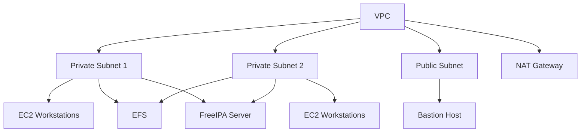
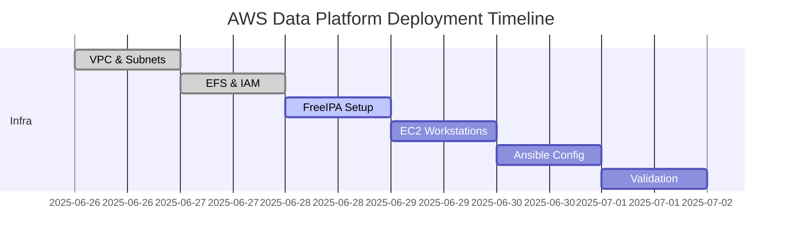

# AWS Data Platform Foundation

---

## Platform Overview

<details>
<summary>Comprehensive Design and Objectives for AWS Data Platform</summary>

---

- **Purpose**: Establish a production-ready AWS-based data platform supporting `20-30` users for data engineering tasks.  
- **Scope**: Includes compute resources, storage, authentication, and automation for scalability and security.  
- **Target outcome**: A blueprint enabling DevOps engineers to deploy the platform without manual AWS console interactions.  
- **Key components**: EC2 instances, IAM roles, NFS storage, FreeIPA, Terraform, and Ansible.  

#### Platform Requirements

- **User support**: Accommodate `20-30` concurrent data engineers with isolated workspaces.  
- **Security**: Enforce least privilege via IAM and centralized authentication.  
- **Scalability**: Support dynamic resource allocation for varying workloads.  
- **Automation**: Use Infrastructure as Code (IaC) for repeatable deployments.  

---

#### Success Metrics

- **Deployment clarity**: DevOps engineers can follow the plan step-by-step.  
- **Operational reliability**: Platform supports continuous operation with minimal downtime.  
- **User accessibility**: Engineers can securely access resources within `5` minutes of onboarding.  

---

</details>

---

## Infrastructure Architecture

<details>
<summary>Detailed System Components and Integration Patterns</summary>

---

- **Compute layer**: EC2 instances (`t3.large`) for user Linux systems, auto-scaled based on demand.  
- **Storage layer**: NFS (EFS) for shared file access across team members.  
- **Networking**: VPC with private subnets, security groups for port `2049` (NFS) and `22` (SSH).  
- **Authentication**: FreeIPA for centralized user management, integrated with IAM roles.

#### Detailed System Architecture

- **Virtual Private Cloud (VPC) design**:
  - Primary CIDR: `10.0.0.0/16` providing `65,536` IP addresses
  - Availability zones: `us-east-1a` and `us-east-1b` for high availability
  - Private subnets: `10.0.1.0/24` and `10.0.2.0/24` for user workspaces
  - Public subnet: `10.0.3.0/24` for NAT Gateway and bastion host
  - Route tables: Separate routing for private and public subnets

- **Compute infrastructure specification**:
  - **User workstations**: EC2 `t3.large` instances (2 vCPU, 8 GB RAM)
  - **FreeIPA server**: EC2 `t3.medium` instance (2 vCPU, 4 GB RAM)
  - **Bastion host**: EC2 `t3.micro` instance for secure SSH access
  - **Auto Scaling Group**: Min `5`, max `30` instances based on demand
  - **Launch template**: Standardized AMI with pre-installed data tools

- **Storage architecture details**:
  - **EFS file system**: General Purpose mode with `100 MB/s` baseline throughput
  - **EFS mount targets**: One per availability zone for redundancy
  - **EFS access points**: Separate directories per user group
  - **EBS volumes**: `50 GB` gp3 root volumes for each EC2 instance
  - **S3 buckets**: Separate buckets for data lake, backups, and artifacts

---

#### Network Security Architecture

- **Security group configurations**:
  ```json
  {
    "UserWorkstationSG": {
      "InboundRules": [
        {
          "Protocol": "TCP",
          "Port": 22,
          "Source": "BastionHostSG",
          "Description": "SSH access from bastion"
        },
        {
          "Protocol": "TCP",
          "Port": 2049,
          "Source": "EFSMOUNTSG",
          "Description": "NFS access to EFS"
        }
      ],
      "OutboundRules": [
        {
          "Protocol": "ALL",
          "Port": "ALL",
          "Destination": "0.0.0.0/0",
          "Description": "All outbound traffic"
        }
      ]
    },
    "FreeIPASG": {
      "InboundRules": [
        {
          "Protocol": "TCP",
          "Port": 389,
          "Source": "10.0.0.0/16",
          "Description": "LDAP access"
        },
        {
          "Protocol": "TCP",
          "Port": 636,
          "Source": "10.0.0.0/16",
          "Description": "LDAPS access"
        },
        {
          "Protocol": "TCP",
          "Port": 88,
          "Source": "10.0.0.0/16",
          "Description": "Kerberos authentication"
        },
        {
          "Protocol": "UDP",
          "Port": 88,
          "Source": "10.0.0.0/16",
          "Description": "Kerberos authentication"
        }
      ]
    }
  }
  ```

- **Network ACL rules**:
  - Default deny-all policy with explicit allow rules
  - Stateless rules for additional security layer
  - Separate NACLs for public and private subnets
  - Logging enabled for all denied traffic

- **VPC Flow Logs configuration**:
  ```hcl
  resource "aws_flow_log" "vpc_flow_log" {
    iam_role_arn    = aws_iam_role.flow_log_role.arn
    log_destination = aws_cloudwatch_log_group.vpc_log_group.arn
    traffic_type    = "ALL"
    vpc_id          = aws_vpc.data_platform_vpc.id
    
    tags = {
      Name = "DataPlatformVPCFlowLog"
      Environment = "production"
    }
  }
  ```

---

#### High Availability and Disaster Recovery

- **Multi-AZ deployment strategy**:
  - EC2 instances distributed across `2` availability zones
  - EFS automatically replicated across multiple AZs
  - RDS instances with Multi-AZ failover for metadata storage
  - Application Load Balancer with cross-zone load balancing

- **Backup and recovery procedures**:
  - **EFS backups**: Daily automatic backups with `30-day` retention
  - **EC2 snapshots**: Weekly AMI creation for rapid instance replacement
  - **Configuration backup**: Terraform state stored in S3 with versioning
  - **User data backup**: Daily synchronization to S3 with lifecycle policies

- **Disaster recovery planning**:
  ```yaml
  DisasterRecoveryPlan:
    RPO: 24 hours  # Recovery Point Objective
    RTO: 4 hours   # Recovery Time Objective
    
    BackupSchedule:
      EFS: "0 2 * * *"      # Daily at 2 AM
      EC2: "0 3 * * 0"      # Weekly on Sunday at 3 AM
      Config: "0 1 * * *"   # Daily at 1 AM
    
    RecoverySteps:
      - "Deploy infrastructure in secondary region using Terraform"
      - "Restore EFS from latest backup"
      - "Launch EC2 instances from latest AMI"
      - "Restore user data from S3 backup"
      - "Update DNS records to point to new region"
  ```

---

#### Performance Optimization

- **EC2 instance optimization**:
  - **Instance types**: Right-sized based on workload analysis
  - **Placement groups**: Cluster placement for high-performance computing
  - **Enhanced networking**: SR-IOV enabled for better network performance
  - **CPU credits**: T3 unlimited mode for burst performance
  - **Memory optimization**: Swap disabled, using EBS-optimized instances

- **EFS performance tuning**:
  - **Throughput mode**: Provisioned mode for consistent performance
  - **Performance mode**: General Purpose for low latency
  - **Mount options**: Optimized for data engineering workloads
  ```bash
  # Optimized EFS mount options
  mount -t efs -o tls,_netdev,fsc \
    fs-0123456789abcdef0.efs.us-east-1.amazonaws.com:/ /data
  ```

- **Network performance optimization**:
  - **Enhanced networking**: Enabled on all instance types that support it
  - **Elastic Network Adapters (ENA)**: For improved packet-per-second performance
  - **SR-IOV**: Hardware-level network virtualization
  - **Bandwidth monitoring**: CloudWatch metrics for network utilization

---

</details>

---

## Access Control Design

<details>
<summary>Comprehensive Authentication, RBAC, and Security Controls</summary>

---

- **Authentication**: FreeIPA server (deployed on EC2) manages user credentials and groups.  
- **Authorization**: IAM roles assigned per user group (e.g., `data_engineer`, `admin`).  
- **Access policies**:  
  - `data_engineer`: Read/write to EFS, execute on EC2, read-only S3 buckets.  
  - `admin`: Full EC2/EFS management, IAM policy updates.

#### Comprehensive Authentication Architecture

- **FreeIPA server deployment**:
  - **Instance specification**: `t3.medium` with `100 GB` EBS storage
  - **Operating system**: Red Hat Enterprise Linux 8 or CentOS 8
  - **Domain configuration**: `ipa.dataplatform.local`
  - **SSL certificates**: Let's Encrypt with automatic renewal
  - **High availability**: Master-replica setup across availability zones

- **User management workflow**:
  ```python
  # FreeIPA user provisioning script
  import ipalib
  from ipalib import api
  
  class UserProvisioning:
      def __init__(self):
          api.bootstrap(context='client')
          api.finalize()
          api.Backend.rpcclient.connect()
      
      def create_user(self, username, first_name, last_name, email, groups):
          """Create new user in FreeIPA with specified groups"""
          try:
              # Create user account
              api.Command.user_add(
                  username,
                  givenname=first_name,
                  sn=last_name,
                  mail=email,
                  userpassword='TempPassword123!',
                  random=True
              )
              
              # Add user to groups
              for group in groups:
                  api.Command.group_add_member(group, user=[username])
              
              return f"User {username} created successfully"
              
          except Exception as e:
              return f"Error creating user: {str(e)}"
      
      def create_service_account(self, service_name, description):
          """Create service account for applications"""
          try:
              api.Command.user_add(
                  service_name,
                  givenname='Service',
                  sn='Account',
                  mail=f'{service_name}@dataplatform.local',
                  nsaccountlock=False,
                  description=description
              )
              
              # Generate keytab for service
              api.Command.service_add(f'{service_name}/dataplatform.local')
              
              return f"Service account {service_name} created"
              
          except Exception as e:
              return f"Error: {str(e)}"
  ```

- **LDAP integration configuration**:
  ```yaml
  # LDAP configuration for AWS SSO
  LDAPSettings:
    ServerURL: "ldaps://ipa.dataplatform.local:636"
    BaseDN: "dc=dataplatform,dc=local"
    BindDN: "uid=ldapbind,cn=users,dc=dataplatform,dc=local"
    UserSearchBase: "cn=users,dc=dataplatform,dc=local"
    GroupSearchBase: "cn=groups,dc=dataplatform,dc=local"
    
    AttributeMapping:
      Username: "uid"
      Email: "mail"
      FirstName: "givenName"
      LastName: "sn"
      Groups: "memberOf"
    
    SecuritySettings:
      RequireSSL: true
      CertificateValidation: true
      EncryptionMethod: "TLS"
      AuthenticationMethod: "Simple"
  ```

---

#### Role-Based Access Control (RBAC) Implementation

- **User group hierarchy**:
  - **`data_engineers`**: Primary user group for data processing tasks
  - **`data_scientists`**: Advanced analytics and ML model development
  - **`platform_admins`**: Infrastructure management and user administration
  - **`security_auditors`**: Read-only access for compliance and auditing
  - **`contractors`**: Limited-time access with restricted permissions

- **IAM role definitions**:
  ```json
  {
    "DataEngineerRole": {
      "Version": "2012-10-17",
      "Statement": [
        {
          "Effect": "Allow",
          "Action": [
            "ec2:DescribeInstances",
            "ec2:StartInstances",
            "ec2:StopInstances",
            "ec2:RebootInstances"
          ],
          "Resource": "*",
          "Condition": {
            "StringEquals": {
              "ec2:ResourceTag/Environment": "data-platform"
            }
          }
        },
        {
          "Effect": "Allow",
          "Action": [
            "s3:GetObject",
            "s3:PutObject",
            "s3:DeleteObject"
          ],
          "Resource": [
            "arn:aws:s3:::data-platform-raw/*",
            "arn:aws:s3:::data-platform-processed/*"
          ]
        },
        {
          "Effect": "Allow",
          "Action": [
            "s3:ListBucket"
          ],
          "Resource": [
            "arn:aws:s3:::data-platform-raw",
            "arn:aws:s3:::data-platform-processed"
          ]
        },
        {
          "Effect": "Allow",
          "Action": [
            "elasticfilesystem:ClientMount",
            "elasticfilesystem:ClientWrite",
            "elasticfilesystem:ClientRootAccess"
          ],
          "Resource": "*",
          "Condition": {
            "StringEquals": {
              "elasticfilesystem:AccessedViaMountTarget": "true"
            }
          }
        }
      ]
    },
    "PlatformAdminRole": {
      "Version": "2012-10-17",
      "Statement": [
        {
          "Effect": "Allow",
          "Action": [
            "ec2:*",
            "efs:*",
            "s3:*",
            "iam:*",
            "cloudwatch:*",
            "logs:*"
          ],
          "Resource": "*",
          "Condition": {
            "StringEquals": {
              "aws:RequestedRegion": "us-east-1"
            }
          }
        }
      ]
    }
  }
  ```

- **Session management and MFA**:
  ```python
  # Multi-factor authentication enforcement
  class MFAEnforcement:
      def __init__(self):
          self.session_timeout = 28800  # 8 hours
          self.mfa_methods = ['TOTP', 'SMS', 'Hardware Token']
      
      def enforce_mfa_policy(self, user_group):
          """Enforce MFA based on user group"""
          mfa_policy = {
              'platform_admins': {
                  'required': True,
                  'methods': ['TOTP', 'Hardware Token'],
                  'session_timeout': 14400  # 4 hours
              },
              'data_engineers': {
                  'required': True,
                  'methods': ['TOTP', 'SMS'],
                  'session_timeout': 28800  # 8 hours
              },
              'contractors': {
                  'required': True,
                  'methods': ['TOTP'],
                  'session_timeout': 7200  # 2 hours
              }
          }
          
          return mfa_policy.get(user_group, {
              'required': False,
              'methods': [],
              'session_timeout': 3600
          })
      
      def validate_session(self, session_token, user_id):
          """Validate user session and MFA status"""
          session_data = self.get_session(session_token)
          
          if not session_data:
              return {'valid': False, 'reason': 'Invalid session'}
          
          if session_data['mfa_verified'] != True:
              return {'valid': False, 'reason': 'MFA required'}
          
          if session_data['expires_at'] < time.time():
              return {'valid': False, 'reason': 'Session expired'}
          
          return {'valid': True, 'user_id': user_id}
  ```

---

#### Advanced Security Controls

- **Zero Trust Network Architecture**:
  - **Principle**: Never trust, always verify
  - **Implementation**: Every network transaction is authenticated and authorized
  - **Components**: Identity verification, device security, application access control
  - **Monitoring**: Continuous verification of user and device behavior

- **Privileged Access Management (PAM)**:
  ```yaml
  # PAM configuration for elevated access
  PAMConfiguration:
    PasswordPolicy:
      MinLength: 14
      RequireUppercase: true
      RequireLowercase: true
      RequireNumbers: true
      RequireSpecialChars: true
      PasswordHistory: 12
      MaxAge: 90
      
    AccessControls:
      SudoAccess:
        - Group: "platform_admins"
          Commands: "ALL"
          Authentication: "required"
          Logging: "enabled"
        
        - Group: "data_engineers"
          Commands: "/usr/bin/systemctl restart docker, /usr/bin/mount"
          Authentication: "required"
          Logging: "enabled"
      
      SSHAccess:
        AllowGroups: ["data_engineers", "platform_admins"]
        DenyUsers: ["root"]
        MaxSessions: 5
        LoginGraceTime: 60
        
    AuditingRules:
      - Event: "sudo_command"
        LogFile: "/var/log/sudo.log"
        RemoteLogging: "enabled"
        
      - Event: "ssh_login"
        LogFile: "/var/log/secure"
        RemoteLogging: "enabled"
  ```

- **Certificate management**:
  ```bash
  #!/bin/bash
  # SSL certificate automation script
  
  # Function to generate and deploy certificates
  deploy_certificates() {
      local domain="$1"
      local service="$2"
      
      # Generate certificate using Let's Encrypt
      certbot certonly \
          --dns-route53 \
          --dns-route53-propagation-seconds 30 \
          -d "$domain" \
          --non-interactive \
          --agree-tos \
          --email admin@dataplatform.local
      
      # Deploy certificate to service
      case "$service" in
          "freeipa")
              cp "/etc/letsencrypt/live/$domain/fullchain.pem" \
                 "/etc/pki/tls/certs/server.crt"
              cp "/etc/letsencrypt/live/$domain/privkey.pem" \
                 "/etc/pki/tls/private/server.key"
              systemctl restart ipa
              ;;
          "nginx")
              cp "/etc/letsencrypt/live/$domain/fullchain.pem" \
                 "/etc/nginx/ssl/$domain.crt"
              cp "/etc/letsencrypt/live/$domain/privkey.pem" \
                 "/etc/nginx/ssl/$domain.key"
              systemctl reload nginx
              ;;
      esac
      
      echo "Certificate deployed for $domain on $service"
  }
  
  # Automated certificate renewal
  setup_auto_renewal() {
      cat > /etc/cron.d/certbot-renewal << EOF
  0 12 * * * root certbot renew --quiet --post-hook "systemctl reload nginx"
  EOF
      
      echo "Auto-renewal configured"
  }
  ```

---

#### Compliance and Audit Framework

- **Compliance requirements**:
  - **SOC 2 Type II**: Security, availability, processing integrity
  - **ISO 27001**: Information security management systems
  - **GDPR**: Data protection and privacy regulations
  - **HIPAA**: Healthcare data security (if applicable)

- **Audit logging implementation**:
  ```python
  import json
  import boto3
  from datetime import datetime
  
  class AuditLogger:
      def __init__(self):
          self.cloudtrail = boto3.client('cloudtrail')
          self.cloudwatch = boto3.client('cloudwatch')
          self.s3 = boto3.client('s3')
      
      def log_user_action(self, user_id, action, resource, details=None):
          """Log user actions for audit trail"""
          audit_event = {
              'timestamp': datetime.utcnow().isoformat(),
              'user_id': user_id,
              'action': action,
              'resource': resource,
              'source_ip': self.get_source_ip(),
              'user_agent': self.get_user_agent(),
              'session_id': self.get_session_id(),
              'details': details or {}
          }
          
          # Send to CloudWatch Logs
          self.send_to_cloudwatch(audit_event)
          
          # Store in S3 for long-term retention
          self.store_in_s3(audit_event)
          
          return audit_event
      
      def generate_compliance_report(self, start_date, end_date):
          """Generate compliance report for auditors"""
          events = self.query_audit_events(start_date, end_date)
          
          report = {
              'report_period': f"{start_date} to {end_date}",
              'total_events': len(events),
              'user_statistics': self.calculate_user_stats(events),
              'security_events': self.filter_security_events(events),
              'policy_violations': self.detect_policy_violations(events),
              'access_patterns': self.analyze_access_patterns(events)
          }
          
          return report
      
      def detect_anomalies(self, user_id, timeframe_hours=24):
          """Detect unusual user behavior patterns"""
          recent_events = self.get_user_events(user_id, timeframe_hours)
          
          anomalies = []
          
          # Check for unusual login times
          if self.is_unusual_login_time(recent_events):
              anomalies.append('unusual_login_time')
          
          # Check for excessive resource access
          if self.is_excessive_access(recent_events):
              anomalies.append('excessive_resource_access')
          
          # Check for privilege escalation attempts
          if self.detect_privilege_escalation(recent_events):
              anomalies.append('privilege_escalation_attempt')
          
          return anomalies
  ```

---

</details>

---

## Infrastructure as Code (IaC) Strategy

<details>
<summary>Terraform & Ansible Automation Plans</summary>

---

- **Terraform module structure**:
  - `vpc`: Defines VPC, subnets, route tables, NACLs
  - `ec2`: Launch templates, Auto Scaling Group for user workstations
  - `efs`: EFS file system, mount targets, access points
  - `iam`: IAM roles and policies for users/groups
  - `security`: Security groups, NACLs, VPC Flow Logs
- **Example Terraform root module**:
  ```hcl
  module "vpc" {
    source = "./modules/vpc"
    cidr_block = "10.0.0.0/16"
  }
  module "efs" {
    source = "./modules/efs"
    performance_mode = "generalPurpose"
  }
  ```
- **Ansible playbook strategy**:
  - Configure FreeIPA server and join EC2 instances to domain
  - Mount EFS on user workstations
  - Harden OS security (disable root SSH, configure firewalld)
  - Example playbook:
    ```yaml
    - hosts: user_workstations
      become: true
      tasks:
        - name: Mount EFS
          mount:
            src: "{{ efs_dns }}:/"
            path: /data
            fstype: nfs4
            opts: "_netdev,tls"
            state: mounted
    ```

---

</details>

---

## Deployment & Operations

<details>
<summary>Step-by-Step Deployment & Maintenance Procedures</summary>

---

#### Deployment Chronology
- **1.** Deploy VPC, subnets, and route tables with Terraform
- **2.** Provision EFS and mount targets
- **3.** Create IAM roles and policies
- **4.** Launch FreeIPA server and configure domain
- **5.** Deploy EC2 user workstations (Auto Scaling Group)
- **6.** Use Ansible to join EC2s to FreeIPA, mount EFS, and apply security hardening
- **7.** Validate access, test user onboarding, and run smoke tests

#### Timeline Estimate
- **Day 1:** VPC, EFS, IAM setup
- **Day 2:** FreeIPA deployment, EC2 launch
- **Day 3:** Ansible configuration, user onboarding, validation

#### Operational Procedures
- **User onboarding:** Scripted via FreeIPA and IAM
- **Backup/restore:** Automated EFS/EC2 snapshot policies
- **Monitoring:** CloudWatch for EC2, EFS, and network
- **Troubleshooting:** SSH via bastion, CloudWatch logs, FreeIPA logs

---

</details>

---

## Architecture Diagrams & Timeline

<details>
<summary>System Topology & Project Gantt Chart</summary>

---

#### Infrastructure Architecture Diagram


#### Project Timeline (Gantt)


---

</details>

---