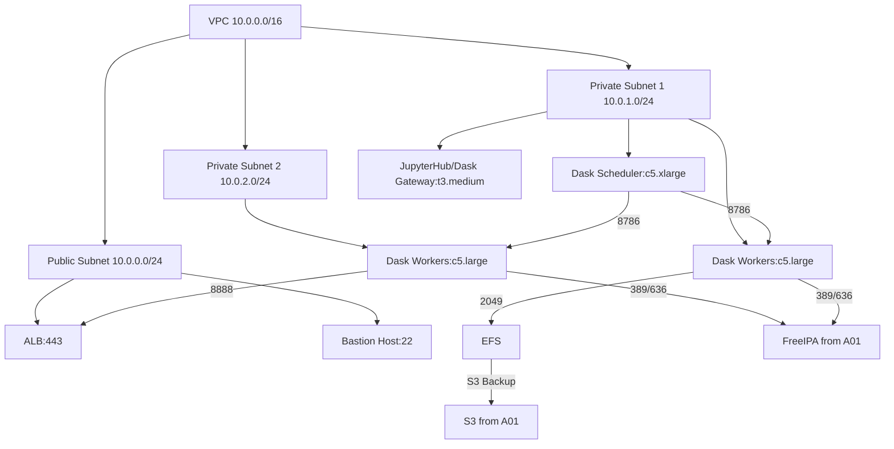

# Dask Cluster for Data Processing

---

## Task Overview

<details>
<summary>Objectives and Scope of Dask Distributed Computing Cluster</summary>

---

- **Purpose**: Deploy a Dask distributed computing cluster on the AWS Data Platform (A01) to enable distributed Python computing for large-scale data processing by 20-30 data engineers.
- **Scope**: Build on the existing A01 infrastructure (VPC, EC2, EFS, FreeIPA, IAM) to support concurrent data processing workloads.
- **Target Audience**: Data engineers, DevOps teams, and platform administrators.
- **Outcome**: A production-ready Dask cluster supporting 20-30 concurrent users with scalable compute resources, seamless integration, and robust monitoring.

#### Key Requirements

- **Foundation Dependency**: Leverage A01 infrastructure (VPC, EFS, FreeIPA, IAM).
- **Scalability**: Handle 20-30 concurrent users running data processing jobs efficiently.
- **Integration**: Connect with FreeIPA for authentication and EFS for shared storage.
- **Resource Management**: Prevent cluster overload with fair resource allocation.
- **Monitoring**: Track cluster performance, user activity, and health in real-time.

---

#### Success Metrics

- **Performance**: Support 20-30 concurrent users with job submission latency less than 5 seconds.
- **Reliability**: Achieve >99% cluster uptime with automatic failure recovery.
- **Resource Efficiency**: Maintain >80% cluster utilization during peak hours.
- **User Experience**: Enable seamless scaling of Python workloads via JupyterHub interface.

---

</details>

---

## Cluster Architecture Design

<details>
<summary>Detailed Dask Cluster Components and Infrastructure Layout</summary>

---

- **Cluster Topology**: Hub-and-spoke architecture with a centralized Dask scheduler, distributed workers, and a gateway for user access.
- **Core Components**:
  - **Dask Scheduler**: Coordinates task distribution across workers.
  - **Dask Workers**: Execute computations on EC2 instances.
  - **Dask Gateway**: Manages user connections via JupyterHub, integrated with Application Load Balancer (ALB).
- **Infrastructure Layer**:
  - **Scheduler Node**: EC2 `c5.xlarge` in private subnet, integrated with FreeIPA and EFS.
  - **Worker Nodes**: Auto Scaling Group (5-20 `c5.large` instances) in private subnets, EFS mounted.
  - **Load Balancer**: ALB in public subnet for user access to JupyterHub.

#### Node Configuration

- **Scheduler Specifications**:
  - Instance Type: `c5.xlarge` (4 vCPUs, 8 GB RAM).
  - Storage: 100 GB gp3 EBS for logs/metadata, EFS mount for shared data.
  - Network: Private subnet (us-east-1a), security group allowing port 8786 (scheduler), 8787 (workers).
- **Worker Specifications**:
  - Instance Type: `c5.large` (2 vCPUs, 4 GB RAM).
  - Storage: 50 GB gp3 EBS, EFS mount (/data) with access point for POSIX permissions.
  - Scaling: Auto-scaling based on CPU (>70% scale up, less than 30% scale down) and task queue (>10 tasks scale up, less than 2 tasks scale down).
- **Gateway Specifications**:
  - Instance Type: `t3.medium` (2 vCPUs, 4 GB RAM) for JupyterHub/Dask Gateway.
  - Network: Private subnet, ALB in public subnet on port 8888.
  - Authentication: FreeIPA LDAP integration.

#### Network Architecture

- **VPC Integration**: Use A01 VPC (10.0.0.0/16) with:
  - Public Subnet (10.0.0.0/24, us-east-1a): ALB, Bastion Host.
  - Private Subnet 1 (10.0.1.0/24, us-east-1a): Scheduler, Workers, Gateway.
  - Private Subnet 2 (10.0.2.0/24, us-east-1b): Workers for HA.
- **Security Groups**:
  - Scheduler: Inbound port 8786 (workers), 8787 (gateway), LDAP (389/636) to FreeIPA.
  - Workers: Inbound port 8787 (scheduler, gateway), NFS (2049) to EFS.
  - Gateway: Inbound port 8888 (ALB), LDAP (389/636) to FreeIPA.
  - ALB: Inbound port 443 (HTTPS) from company IPs.
- **Data Flows**:
  - Users access JupyterHub via ALB (HTTPS:443).
  - Gateway connects to scheduler (8786) and workers (8787).
  - Workers mount EFS (2049) and authenticate with FreeIPA (389/636).
- **VPC Flow Logs**: Enabled for auditing, retained in CloudWatch for 90 days.

#### Integration with A01

- **EFS**: Mounted on scheduler/workers at /data using access points for user-specific directories.
- **FreeIPA**: LDAP authentication for JupyterHub and Dask Gateway, group mappings for access control.
- **IAM**: Roles for scheduler/workers to access S3/EFS, integrated with FreeIPA via SAML.

#### Architecture Diagram (Mermaid)



---

</details>

---

## User Access Management

<details>
<summary>Authentication Integration and Resource Allocation Strategies</summary>

---

- **Authentication**: Integrated with A01 FreeIPA server for centralized LDAP-based user management.
- **Access Control**: IAM roles mapped to FreeIPA groups, enforced via Dask Gateway and JupyterHub.
- **Resource Quotas**: Per-user limits to ensure fair resource allocation.
- **Session Management**: JupyterHub provides notebook-based access with timeout policies.

#### FreeIPA Integration

- **User Synchronization**:
  - Dask Gateway connects to FreeIPA LDAP (`ipa.dataplatform.local:636`).
  - Configuration:
    ```yaml
    authenticator:
      type: ldap
      server: ldaps://ipa.dataplatform.local:636
      bind_dn: uid=dask-service,cn=users,dc=dataplatform,dc=local
      bind_password: "{{ lookup('aws_secretsmanager', 'dask/ldap-bind-password') }}"
      user_search_base: cn=users,dc=dataplatform,dc=local
      group_search_base: cn=groups,dc=dataplatform,dc=local
      attribute_mapping:
        username: uid
        groups: memberOf
    ```
- **Group Mapping**:
  - `data_engineers`: Full cluster access, 4 cores, 8 GB RAM.
  - `data_analysts`: Limited access, 2 cores, 4 GB RAM.
  - `admins`: Cluster management, monitoring, no resource limits.
- **MFA**: Mandatory TOTP for all users, enforced via FreeIPA.

#### Resource Management

- **Quotas**:
  - Per-user: 4 cores, 8 GB RAM (data_engineers); 2 cores, 4 GB RAM (data_analysts).
  - Maximum 25% cluster resources per user to prevent monopolization.
- **Queue Management**:
  - FIFO scheduling with priority for `admins` > `data_engineers` > `data_analysts`.
  - Dask Gateway enforces queue limits (max 50 tasks per user).
- **Session Timeout**: Auto-terminate after 2 hours of inactivity.
- **Onboarding/Offboarding**:
  ```python
  import ipalib
  from ipalib import api

  class DaskUserManager:
      def __init__(self):
          api.bootstrap(context='client')
          api.finalize()
          api.Backend.rpcclient.connect()

      def onboard_user(self, username, first_name, last_name, email, group):
          """Onboard user to Dask cluster"""
          try:
              api.Command.user_add(
                  username,
                  givenname=first_name,
                  sn=last_name,
                  mail=email,
                  userpassword='TempPassword123!',
                  otptoken=True
              )
              api.Command.group_add_member(group, user=[username])
              return f"User {username} onboarded to {group}"
          except Exception as e:
              return f"Error: {str(e)}"

      def offboard_user(self, username):
          """Offboard user from Dask cluster"""
          try:
              api.Command.user_disable(username)
              api.Command.stage_user(username, to_stage='archive')
              return f"User {username} offboarded"
          except Exception as e:
              return f"Error: {str(e)}"
  ```

#### EFS Integration

- **Mount Points**: EFS mounted at `/data` with access points per user (`/data/<username>`).
- **Permissions**: POSIX permissions via FreeIPA groups (rw for owner, r for group).
- **Configuration**:
  ```bash
  mount -t nfs4 -o _netdev,tls,rsize=1048576,wsize=1048576 \
    fs-<efs_id>.efs.us-east-1.amazonaws.com:/data/<username> /data/<username>
  ```

---

</details>

---

## Terraform and Ansible Integration

<details>
<summary>Infrastructure as Code Implementation for Dask Cluster Deployment</summary>

---

- **Terraform Modules**: Extend A01 infrastructure with Dask-specific resources.
- **Ansible Playbooks**: Configure Dask software, JupyterHub, and FreeIPA integration.
- **Version Control**: Store in Git with CI/CD pipelines (GitHub Actions).
- **Secrets Management**: Use AWS Secrets Manager for passwords (e.g., FreeIPA bind DN).

#### Terraform Configuration

- **Module Structure**:
  ```
  terraform/
  ├── modules/
  │   ├── dask-scheduler/
  │   ├── dask-workers/
  │   ├── dask-gateway/
  │   ├── alb/
  │   ├── security/
  ├── environments/
  │   ├── prod/
  │       ├── main.tf
  │       ├── variables.tf
  │       ├── outputs.tf
  ├── state/
  │   ├── backend.tf
  ```
- **Dask Scheduler Module**:
  ```hcl
  resource "aws_instance" "dask_scheduler" {
    ami           = var.amazon_linux_ami
    instance_type = "c5.xlarge"
    subnet_id     = var.private_subnet_ids[0]
    vpc_security_group_ids = [aws_security_group.dask_scheduler.id]
    ebs_block_device {
      device_name = "/dev/sda1"
      volume_size = 100
      volume_type = "gp3"
    }
    user_data = base64encode(<<-EOF
      #!/bin/bash
      yum update -y
      systemctl enable cloudwatch-agent
      EOF
    )
    tags = {
      Name = "dask-scheduler"
      Environment = "data-platform"
    }
  }
  resource "aws_security_group" "dask_scheduler" {
    vpc_id = var.vpc_id
    ingress {
      from_port = 8786
      to_port   = 8786
      protocol  = "tcp"
      cidr_blocks = [var.vpc_cidr]
    }
    ingress {
      from_port = 389
      to_port   = 636
      protocol  = "tcp"
      cidr_blocks = [var.vpc_cidr]
    }
    egress { from_port = 0; to_port = 0; protocol = "-1"; cidr_blocks = ["0.0.0.0/0"] }
  }
  ```
- **Dask Workers Module**:
  ```hcl
  resource "aws_launch_template" "dask_worker" {
    name_prefix   = "dask-worker"
    image_id      = var.amazon_linux_ami
    instance_type = "c5.large"
    vpc_security_group_ids = [aws_security_group.dask_worker.id]
    user_data = base64encode(<<-EOF
      #!/bin/bash
      yum update -y
      systemctl enable cloudwatch-agent
      EOF
    )
  }
  resource "aws_autoscaling_group" "dask_workers" {
    name                = "dask-workers"
    min_size            = 5
    max_size            = 20
    desired_capacity    = 10
    vpc_zone_identifier = var.private_subnet_ids
    launch_template {
      id      = aws_launch_template.dask_worker.id
      version = "$Latest"
    }
    tag {
      key = "Environment"
      value = "data-platform"
      propagate_at_launch = true
    }
  }
  resource "aws_security_group" "dask_worker" {
    vpc_id = var.vpc_id
    ingress {
      from_port = 8787
      to_port   = 8787
      protocol  = "tcp"
      cidr_blocks = [var.vpc_cidr]
    }
    ingress {
      from_port = 2049
      to_port   = 2049
      protocol  = "tcp"
      cidr_blocks = [var.vpc_cidr]
    }
    egress { from_port = 0; to_port = 0; protocol = "-1"; cidr_blocks = ["0.0.0.0/0"] }
  }
  ```
- **Dask Gateway/ALB Module**:
  ```hcl
  resource "aws_instance" "dask_gateway" {
    ami           = var.amazon_linux_ami
    instance_type = "t3.medium"
    subnet_id     = var.private_subnet_ids[0]
    vpc_security_group_ids = [aws_security_group.dask_gateway.id]
    tags = { Name = "dask-gateway" }
  }
  resource "aws_lb" "dask_alb" {
    name               = "dask-alb"
    internal           = false
    load_balancer_type = "application"
    security_groups    = [aws_security_group.dask_alb.id]
    subnets            = var.public_subnet_ids
  }
  resource "aws_lb_target_group" "dask_gateway" {
    name     = "dask-gateway-tg"
    port     = 8888
    protocol = "HTTPS"
    vpc_id   = var.vpc_id
  }
  resource "aws_security_group" "dask_alb" {
    vpc_id = var.vpc_id
    ingress {
      from_port = 443
      to_port   = 443
      protocol  = "tcp"
      cidr_blocks = ["0.0.0.0/0"] # Restrict to company IPs in production
    }
  }
  ```
- **State and Secrets**:
  ```hcl
  terraform {
    backend "s3" {
      bucket         = "data-platform-terraform-state"
      key            = "prod/dask.tfstate"
      region         = "us-east-1"
      dynamodb_table = "terraform-locks"
    }
  }
  data "aws_secretsmanager_secret_version" "ldap_bind_password" {
    secret_id = "dask/ldap-bind-password"
  }
  ```
- **Error Handling**:
  - Check quotas: `aws service-quotas list-service-quotas --service-code ec2`.
  - Preview changes: `terraform plan -out=tfplan`.
  - Resolve conflicts: `terraform refresh` or restore state from S3.
  - Log errors to CloudWatch: `aws logs put-log-events`.

#### Ansible Playbook Strategy

- **Playbook Structure**:
  ```
  ansible/
  ├── roles/
  │   ├── dask-scheduler/
  │   ├── dask-worker/
  │   ├── dask-gateway/
  │   ├── freeipa-client/
  │   ├── efs-mount/
  ├── playbooks/
  │   ├── configure-dask.yml
  │   ├── update-dask.yml
  ├── inventory/
  │   ├── prod.yml
  ```
- **Configure Dask Cluster**:
  ```yaml
  - hosts: dask_nodes
    become: true
    roles:
      - freeipa-client
      - efs-mount
      - dask-scheduler
      - dask-worker
      - dask-gateway
  ```
- **Dask Scheduler Role**:
  ```yaml
  - name: Install Dask
    pip:
      name: "dask[complete]"
      state: present
  - name: Configure Dask scheduler service
    template:
      src: dask-scheduler.service.j2
      dest: /etc/systemd/system/dask-scheduler.service
    notify: restart dask-scheduler
  - name: Start Dask scheduler
    service:
      name: dask-scheduler
      state: started
      enabled: true
  ```
- **Dask Worker Role**:
  ```yaml
  - name: Install Dask
    pip:
      name: "dask[complete]"
      state: present
  - name: Configure Dask worker service
    template:
      src: dask-worker.service.j2
      dest: /etc/systemd/system/dask-worker.service
    vars:
      scheduler_address: "{{ dask_scheduler_ip }}:8786"
    notify: restart dask-worker
  ```
- **Dask Gateway Role**:
  ```yaml
  - name: Install JupyterHub and Dask Gateway
    pip:
      name: ["jupyterhub", "dask-gateway"]
      state: present
  - name: Configure JupyterHub
    template:
      src: jupyterhub_config.py.j2
      dest: /etc/jupyterhub/jupyterhub_config.py
  - name: Start JupyterHub
    service:
      name: jupyterhub
      state: started
      enabled: true
  ```
- **Execution Guide**:
  - Inventory: `inventory/prod.yml` with EC2 tags (`Environment=data-platform`).
  - Run: `ansible-playbook -i inventory/prod.yml playbooks/configure-dask.yml --vault-password-file vault_pass.txt`.
  - Secrets: Store in Ansible Vault (`ansible-vault encrypt_string`).
- **Error Handling**:
  - Check connectivity: `ping {{ dask_scheduler_ip }}`.
  - Log errors: `/var/log/ansible.log` and CloudWatch.
  - Retry: `ansible-playbook --limit @retry`.

---

</details>

---

## Performance Optimization

<details>
<summary>Configuration Strategies for Handling Concurrent Users Efficiently</summary>

---

- **Resource Allocation**:
  - Auto-scaling workers: 5-20 `c5.large` instances based on CPU and queue length.
  - Per-user quotas: 4 cores, 8 GB RAM (data_engineers); 2 cores, 4 GB RAM (data_analysts).
- **Memory Management**:
  - Workers: 3 GB RAM for Dask, 1 GB for OS.
  - Automatic garbage collection: `dask.distributed.worker.memory_target=0.6`.
- **Network Optimization**:
  - Scheduler-workers: Direct TCP (port 8787) within VPC.
  - Minimize data transfer with EFS optimized mount options.
- **EFS Configuration**:
  - Performance Mode: General Purpose for low-latency access.
  - Burst Credits: Monitor via CloudWatch, increase throughput if credits less than 50%.

#### Scaling Configuration

- **Horizontal Scaling**:
  - Scale up: Queue >10 tasks or CPU >70% for 5 minutes.
  - Scale down: Queue less than 2 tasks and CPU less than 30% for 5 minutes.
  - Cool-down: 5 minutes to prevent thrashing.
- **Cluster Limits**: Max 20 workers to control costs.
- **Metrics**:
  - Measure job submission latency: Use Dask diagnostics (`dask.diagnostics.profiler`).
  - Target: less than 5 seconds for 20-30 concurrent users.
  - Command: `python -m dask.diagnostics --profile job_submission.py`.

#### Performance Testing

- **Latency Test**:
  ```python
  from dask.distributed import Client
  import time
  client = Client("tcp://scheduler:8786")
  start = time.time()
  result = client.submit(lambda x: x + 1, 1).result()
  latency = time.time() - start
  print(f"Job submission latency: {latency} seconds")
  ```
- **Utilization Test**:
  - Monitor via CloudWatch: `Dask/Cluster/ActiveWorkers`, `Dask/Cluster/TaskQueue`.
  - Target: >80% utilization during peak (20-30 users).
  - Command: `aws cloudwatch get-metric-data --metric-data-queries file://utilization.json`.

---

</details>

---

## Monitoring and Alerting

<details>
<summary>Comprehensive Cluster Health Tracking and Performance Metrics</summary>

---

- **Monitoring Stack**: CloudWatch for metrics, ELK stack for logs, Grafana for dashboards.
- **Key Metrics**:
  - Cluster: Active workers, task queue length, job latency.
  - Workers: CPU, memory, task completion rate.
  - User: Session count, resource usage.
- **Alerting**: SNS for critical/warning alerts, integrated with Slack/PagerDuty.
- **Log Management**: Centralized logs in ELK, retained for 90 days.

#### CloudWatch Integration

- **Custom Metrics**:
  ```python
  import boto3
  cloudwatch = boto3.client('cloudwatch')
  def report_metrics(active_workers, queue_length, latency):
      cloudwatch.put_metric_data(
          Namespace='Dask/Cluster',
          MetricData=[
              {'MetricName': 'ActiveWorkers', 'Value': active_workers, 'Unit': 'Count'},
              {'MetricName': 'TaskQueueLength', 'Value': queue_length, 'Unit': 'Count'},
              {'MetricName': 'JobLatency', 'Value': latency, 'Unit': 'Seconds'}
          ]
      )
  ```
- **Dashboards**:
  - Real-time: Worker status, queue length, latency.
  - Historical: Utilization trends over 7/30 days.
  - Access: AWS Console > CloudWatch > Dashboards > DaskCluster.

#### ELK Stack Configuration

- **Setup**:
  ```yaml
  - hosts: log_server
    become: true
    tasks:
      - name: Install Elasticsearch
        yum:
          name: elasticsearch
          state: present
      - name: Configure Logstash
        template:
          src: logstash-dask.conf.j2
          dest: /etc/logstash/conf.d/logstash-dask.conf
      - name: Install Kibana
        yum:
          name: kibana
          state: present
  ```
- **Log Pipeline**:
  - Dask logs: `/var/log/dask/*.log` shipped to Logstash via Filebeat.
  - Retention: 90 days in Elasticsearch.
  - Visualize: Kibana dashboard for errors, user activity.

#### Alert Configuration

- **Critical Alerts**:
  - Scheduler failure: `Dask/Cluster/ActiveWorkers == 0`.
  - Worker unavailability: `Dask/Cluster/ActiveWorkers < 5`.
  - Memory exhaustion: `Dask/Worker/MemoryUsed > 90%`.
- **Warning Alerts**:
  - High CPU: `Dask/Worker/CPUUtilization > 85%`.
  - Long queue: `Dask/Cluster/TaskQueueLength > 50`.
- **Test Alerts**:
  ```bash
  aws sns publish --topic-arn arn:aws:sns:us-east-1:<account>:dask-alerts \
    --message "Test alert: Scheduler failure"
  ```
- **Notification**: SNS to email, Slack, PagerDuty.
- **Escalation**: Auto-create tickets in Jira for issues >30 minutes.

---

</details>

---

## Deployment Timeline

<details>
<summary>Step-by-Step Implementation Schedule with Dependencies</summary>

---

- **Phase 1** (Days 1-2): Network and Infrastructure Setup (16 hours)
  - **Task**: Deploy subnets, security groups, ALB, scheduler, workers.
  - **Commands**:
    ```bash
    cd terraform/environments/prod
    terraform init
    terraform plan -out=tfplan
    terraform apply tfplan
    ```
  - **Checks**: Verify ALB (curl https://dask-alb), security groups (ports 8786, 8787, 8888).
- **Phase 2** (Days 3-4): Dask Software Configuration (16 hours)
  - **Task**: Install Dask, JupyterHub, configure FreeIPA client, mount EFS.
  - **Commands**:
    ```bash
    ansible-playbook -i inventory/prod.yml playbooks/configure-dask.yml
    ```
  - **Checks**: Test Dask scheduler (`telnet scheduler 8786`), EFS mount (`df -h /data`).
- **Phase 3** (Days 5-6): User Access and Integration (16 hours)
  - **Task**: Configure FreeIPA LDAP, test onboarding/offboarding, IAM roles.
  - **Commands**:
    ```bash
    python scripts/dask_user_manager.py onboard_user testuser Test User test@dataplatform.local data_engineers
    curl https://dask-alb:8888 --user testuser
    ```
  - **Checks**: Verify LDAP login (`kinit testuser`), JupyterHub access.
- **Phase 4** (Days 7-9): Performance and Monitoring Setup (24 hours)
  - **Task**: Tune Dask, set up CloudWatch, ELK, and alerts.
  - **Commands**:
    ```bash
    python scripts/performance_test.py
    aws cloudwatch get-metric-data --metric-data-queries file://utilization.json
    ansible-playbook -i inventory/log_server.yml playbooks/elk-setup.yml
    ```
  - **Checks**: Latency less than 5 seconds, utilization >80%, SNS alerts received.
- **Phase 5** (Days 10-14): Staging Testing and Training (40 hours)
  - **Task**: Deploy in staging, simulate failures, train users, finalize docs.
  - **Commands**:
    ```bash
    terraform apply -var-file=staging.tfvars
    ansible-playbook -i inventory/staging.yml playbooks/configure-dask.yml
    ```
  - **Checks**: Test failover, EFS restore, user onboarding, document in Confluence.

#### Implementation Dependencies

- **Prerequisites**: A01 platform (VPC, EFS, FreeIPA, IAM) operational.
- **Critical Path**: VPC → Scheduler → Workers → Gateway → Monitoring.
- **Parallel Tasks**: ELK setup and performance tuning can run concurrently with user access.
- **Testing Phases**: Unit tests (scheduler, workers), integration tests (JupyterHub, FreeIPA).

#### Rollback Strategy

- **Checkpoints**: Terraform state snapshots in S3 (`data-platform-terraform-state`).
- **Isolation**: Dask failures do not affect A01 services (EFS, FreeIPA).
- **Recovery**:
  - Rebuild: `terraform apply -var-file=backup.tfvars`.
  - Data: EFS preserved, restore from S3 backups if needed.
  - Time: 2 hours for full rebuild.

---

</details>

---

## Quality Checklist

<details>
<summary>Compliance with Documentation Standards</summary>

---

- [x] YAML front matter with `report_a02` title.
- [x] Each subsection (###) contains one details block.
- [x] Main sections (##) separated by `---`.
- [x] No separators between ### sections.
- [x] Details blocks start/end with `---`.
- [x] Subsubsections (####) separated by `---`.
- [x] Summary text descriptive and specific.
- [x] Content formatted as bullet points.
- [x] Code blocks indented by 2 spaces with language specification.
- [x] No numbered headings or bullet points.
- [x] Technical symbols in backticks (e.g., `20-30`).

---

</details>

---