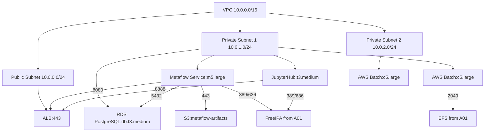

# Metaflow ML Pipeline Platform

---

## Task Overview

<details>
<summary>Objectives and Scope of Metaflow ML Pipeline Deployment</summary>

---

- **Purpose**: Deploy a Metaflow cluster to enable 20-30 data scientists and ML engineers to build, run, and manage scalable, reproducible ML pipelines.
- **Scope**: Leverage A01 AWS Data Platform (VPC, EC2, EFS, FreeIPA, IAM) for ML workflow orchestration.
- **Target Audience**: Data scientists, ML engineers, DevOps, and platform administrators.
- **Outcome**: A production-ready Metaflow platform supporting 20-30 users with seamless local-to-cloud pipeline execution.

#### Key Requirements

- **Foundation Dependency**: Build on A01 infrastructure (VPC, EFS, FreeIPA, IAM).
- **ML Workflow Focus**: Enable versioned, reproducible, scalable ML pipelines (data ingestion → feature engineering → training → deployment).
- **Cloud Integration**: Use S3 for artifacts, EC2/AWS Batch for compute scaling.
- **User Accessibility**: Support local development and cloud execution via JupyterHub.
- **Pipeline Templates**: Provide standardized templates for common ML workflows.

---

#### Success Metrics

- **User Adoption**: >90% ML team using Metaflow within 2 months.
- **Pipeline Reliability**: >95% successful pipeline execution rate.
- **Development Velocity**: Reduce ML experiment iteration time by 50%.
- **Resource Efficiency**: Auto-scaling reduces compute costs by 30%.

---

</details>

---

## Architecture Design

<details>
<summary>Metaflow Components and AWS Service Integration Patterns</summary>

---

- **Core Architecture**: Metaflow orchestrates ML workflows using AWS services for metadata, storage, and compute.
- **Service Components**:
  - **Metaflow Service**: Central metadata and orchestration engine.
  - **Metadata Store**: RDS PostgreSQL for pipeline versioning and lineage.
  - **Artifact Store**: S3 buckets for model artifacts and intermediate data.
  - **Compute Backend**: AWS Batch with EC2 Spot instances for scalable execution.
- **Integration Layer**: Connects with A01 VPC, EFS, FreeIPA, and IAM.

#### Component Relationships

- **Metaflow Service**:
  - Instance: EC2 `m5.large` (2 vCPUs, 8 GB RAM).
  - Storage: 100 GB gp3 EBS, EFS mount at `/data`.
  - Network: Private subnet (us-east-1a), port 8080 for API/UI.
- **Metadata Store**:
  - RDS PostgreSQL `db.t3.medium` (2 vCPUs, 4 GB RAM), 100 GB storage.
  - Multi-AZ for HA, automated backups.
- **Artifact Store**:
  - S3 bucket (`metaflow-artifacts-<id>`) with versioning, lifecycle policies (Glacier after 90 days).
- **Compute Backend**:
  - AWS Batch job queue, EC2 Spot instances (`c5.large`, 2 vCPUs, 4 GB RAM).
  - Auto-scaling: Queue depth >10 jobs scale up, &lt; 2 jobs scale down.

#### AWS Service Integration

- **S3 Artifact Storage**:
  ```python
  from metaflow import S3, FlowSpec, step, batch
  class MLPipeline(FlowSpec):
      @step
      def train_model(self):
          with S3(s3root='s3://metaflow-artifacts/models/') as s3:
              s3.put('model.pkl', pickle.dumps(train_ml_model(self.data)))
          self.next(self.evaluate)
  ```
- **AWS Batch**:
  - Job queue: `metaflow-pipeline-queue`.
  - Compute environment: Spot instances, auto-scaling based on queue depth.
- **EFS**: Mounted at `/data/<username>` with access points for user datasets.
- **FreeIPA**: LDAP authentication for Metaflow service and JupyterHub.

#### Architecture Diagram (Mermaid)



---

</details>

---

## User Workspace Setup

<details>
<summary>Development Environment and Pipeline Creation Workflows</summary>

---

- **Local Development**: Workstations with Metaflow client, AWS CLI, and Conda.
- **Cloud Execution**: Seamless transition to AWS Batch via `@batch` decorator.
- **Notebook Integration**: JupyterHub for interactive ML development.
- **Version Control**: Git for pipeline code, Metaflow for versioning.

#### Development Environment Configuration

- **Metaflow Client Setup**:
  ```bash
  pip install metaflow[aws] jupyter awscli
  metaflow configure aws --profile metaflow-user
  ```
- **AWS Credentials**:
  - FreeIPA generates temporary credentials via SAML.
  - MFA (TOTP) mandatory, enforced by FreeIPA.
- **JupyterHub**:
  - Instance: `t3.medium`, private subnet, ALB on port 443.
  - Authentication: FreeIPA LDAP.
- **Conda Environment**:
  ```bash
  conda create -n metaflow python=3.9
  conda activate metaflow
  pip install metaflow[aws] scikit-learn pandas
  ```

#### Pipeline Development Workflow

- **Onboarding**:
  ```python
  import ipalib
  from ipalib import api
  class MetaflowUserManager:
      def __init__(self):
          api.bootstrap(context='client')
          api.finalize()
          api.Backend.rpcclient.connect()
      def onboard_user(self, username, first_name, last_name, email, group):
          api.Command.user_add(
              username, givenname=first_name, sn=last_name, mail=email,
              userpassword='TempPassword123!', otptoken=True
          )
          api.Command.group_add_member(group, user=[username])
          return f"User {username} onboarded"
      def offboard_user(self, username):
          api.Command.user_disable(username)
          api.Command.stage_user(username, to_stage='archive')
          return f"User {username} offboarded"
  ```
- **Pipeline Example**:
  ```python
  from metaflow import FlowSpec, step, batch
  class MLPipeline(FlowSpec):
      @step
      def start(self):
          self.raw_data = load_data('s3://data-platform-raw/data.csv')
          self.next(self.preprocess)
      @batch(cpu=4, memory=8000)
      @step
      def preprocess(self):
          self.clean_data = preprocess(self.raw_data)
          self.next(self.train)
      @batch(cpu=4, memory=8000)
      @step
      def train(self):
          self.model = train_model(self.clean_data)
          self.next(self.end)
  ```
- **Testing**:
  ```bash
  python pipeline.py run --with local  # Local test
  python pipeline.py run --with batch  # Cloud execution
  ```

---

</details>

---

## Pipeline Templates

<details>
<summary>Standardized Starting Points for Common ML Workflows</summary>

---

- **Template Categories**: Classification, regression, time series, NLP, computer vision.
- **Best Practices**: Data validation, model evaluation, deployment hooks.
- **Customization**: YAML-based configuration, modular components.
- **Documentation**: Guides and examples in Confluence/Wiki.

#### Standard Template Structure

- **Data Ingestion**:
  ```python
  from metaflow import step
  @step
  def ingest_data(self):
      self.dataset = load_and_validate_data(
          source=self.input('data_source', 's3://data-platform-raw'),
          schema=self.input('schema', {'column': 'type'})
      )
      self.next(self.split_data)
  ```
- **Model Training**:
  ```python
  @batch(cpu=4, memory=8000)
  @step
  def train(self):
      self.model = train_model(
          data=self.clean_data,
          params=self.input('hyperparams', {'lr': 0.01})
      )
      with S3(s3root='s3://metaflow-artifacts/models/') as s3:
          s3.put('model.pkl', pickle.dumps(self.model))
      self.next(self.evaluate)
  ```
- **Evaluation**:
  ```python
  @step
  def evaluate(self):
      self.metrics = evaluate_model(self.model, self.test_data)
      self.next(self.end)
  ```
- **Deployment**:
  ```python
  @step
  def deploy(self):
      register_model(self.model, 's3://metaflow-artifacts/models/model-latest.pkl')
      self.next(self.end)
  ```

#### Template Customization

- **Configuration**:
  ```yaml
  pipeline_config:
    data_source: s3://data-platform-raw/data.csv
    schema:
      feature1: float
      label: int
    hyperparams:
      lr: 0.01
      epochs: 100
  ```
- **Modularity**: Swap algorithms (e.g., scikit-learn → TensorFlow) via YAML.
- **Validation**: Built-in checks for data quality, model accuracy >0.8.

---

</details>

---

## Infrastructure Automation

<details>
<summary>Terraform and Ansible Configurations for Metaflow Deployment</summary>

---

- **Terraform Modules**: Provision Metaflow service, RDS, S3, AWS Batch, and JupyterHub.
- **Ansible Playbooks**: Configure Metaflow, PostgreSQL, and user environments.
- **CI/CD**: GitHub Actions for automated deployment.
- **Secrets**: AWS Secrets Manager for RDS/FreeIPA credentials.

#### Terraform Configuration

- **Module Structure**:
  ```
  terraform/
  ├── modules/
  │   ├── metaflow-service/
  │   ├── rds/
  │   ├── s3/
  │   ├── batch/
  │   ├── jupyterhub/
  │   ├── security/
  ├── environments/
  │   ├── prod/
  │       ├── main.tf
  │       ├── variables.tf
  │       ├── outputs.tf
  ├── state/
  │   ├── backend.tf
  ```
- **Metaflow Service**:
  ```hcl
  resource "aws_instance" "metaflow_service" {
    ami           = var.amazon_linux_ami
    instance_type = "m5.large"
    subnet_id     = var.private_subnet_ids[0]
    vpc_security_group_ids = [aws_security_group.metaflow.id]
    ebs_block_device {
      device_name = "/dev/sda1"
      volume_size = 100
      volume_type = "gp3"
    }
    tags = { Name = "metaflow-service" }
  }
  resource "aws_security_group" "metaflow" {
    vpc_id = var.vpc_id
    ingress {
      from_port = 8080
      to_port   = 8080
      protocol  = "tcp"
      cidr_blocks = [var.vpc_cidr]
    }
    ingress {
      from_port = 5432
      to_port   = 5432
      protocol  = "tcp"
      cidr_blocks = [var.vpc_cidr]
    }
  }
  ```
- **RDS PostgreSQL**:
  ```hcl
  resource "aws_db_instance" "metaflow_rds" {
    identifier          = "metaflow-metadata"
    instance_class      = "db.t3.medium"
    allocated_storage   = 100
    engine              = "postgres"
    engine_version      = "13.7"
    username            = "metaflow"
    password            = data.aws_secretsmanager_secret_version.rds_password.secret_string
    vpc_security_group_ids = [aws_security_group.rds.id]
    multi_az            = true
    backup_retention_period = 7
  }
  ```
- **AWS Batch**:
  ```hcl
  resource "aws_batch_compute_environment" "metaflow" {
    compute_environment_name = "metaflow-compute"
    type = "SPOT"
    compute_resources {
      instance_type = ["c5.large"]
      min_vcpus = 4
      max_vcpus = 64
      subnets = var.private_subnet_ids
      security_group_ids = [aws_security_group.batch.id]
      spot_iam_fleet_role = aws_iam_role.batch_fleet.arn
    }
  }
  resource "aws_batch_job_queue" "metaflow_queue" {
    name = "metaflow-pipeline-queue"
    state = "ENABLED"
    priority = 1
    compute_environment_order {
      order = 1
      compute_environment = aws_batch_compute_environment.metaflow.arn
    }
  }
  ```
- **State and Secrets**:
  ```hcl
  terraform {
    backend "s3" {
      bucket = "data-platform-terraform-state"
      key = "prod/metaflow.tfstate"
      region = "us-east-1"
      dynamodb_table = "terraform-locks"
    }
  }
  data "aws_secretsmanager_secret_version" "rds_password" {
    secret_id = "metaflow/rds-password"
  }
  ```

#### Ansible Playbook Strategy

- **Playbook Structure**:
  ```
  ansible/
  ├── roles/
  │   ├── metaflow-service/
  │   ├── rds-init/
  │   ├── batch-config/
  │   ├── jupyterhub/
  │   ├── efs-mount/
  │   ├── freeipa-client/
  ├── playbooks/
  │   ├── configure-metaflow.yml
  ├── inventory/
  │   ├── prod.yml
  ```
- **Metaflow Service**:
  ```yaml
  - hosts: metaflow_service
    become: true
    roles:
      - freeipa-client
      - efs-mount
      - metaflow-service
  - name: Install Metaflow
    pip:
      name: metaflow
      state: present
  - name: Configure Metaflow
    template:
      src: metaflow-service.conf.j2
      dest: /etc/metaflow/service.conf
    notify: restart metaflow-service
  ```
- **RDS Initialization**:
  ```yaml
  - hosts: metaflow_rds
    tasks:
      - name: Initialize PostgreSQL schema
        postgresql_query:
          db: metaflow
          login_user: metaflow
          login_password: "{{ lookup('aws_secretsmanager', 'metaflow/rds-password') }}"
          query: |
            CREATE SCHEMA metaflow;
            CREATE TABLE metaflow.flows (id SERIAL PRIMARY KEY, name VARCHAR);
  ```
- **JupyterHub**:
  ```yaml
  - hosts: jupyterhub
    become: true
    tasks:
      - name: Install JupyterHub
        pip:
          name: ["jupyterhub", "metaflow"]
          state: present
      - name: Configure JupyterHub
        template:
          src: jupyterhub_config.py.j2
          dest: /etc/jupyterhub/jupyterhub_config.py
        notify: restart jupyterhub
  ```
- **Execution Guide**:
  - Inventory: `inventory/prod.yml` with EC2 tags (`Environment=data-platform`).
  - Run: `ansible-playbook -i inventory/prod.yml playbooks/configure-metaflow.yml --vault-password-file vault_pass.txt`.
  - Secrets: Ansible Vault for passwords.
- **Error Handling**:
  - Check connectivity: `psql -h rds_endpoint -U metaflow`.
  - Log errors: `/var/log/ansible.log`, CloudWatch.
  - Retry: `ansible-playbook --limit @retry`.

---

</details>

---

## Integration Strategy

<details>
<summary>Connections with Existing Data Sources and A01 Platform Services</summary>

---

- **Data Source Integration**:
  - **S3**: `s3://data-platform-raw` for raw data, `s3://metaflow-artifacts` for models.
  - **RDS/Redshift**:
    ```python
    import psycopg2
    def connect_redshift():
        conn = psycopg2.connect(
            dbname='datawarehouse', user='metaflow',
            password=lookup_aws_secrets('metaflow/redshift-password'),
            host='redshift-cluster.us-east-1.redshift.amazonaws.com', port=5439
        )
        return conn
    ```
  - **Kinesis**:
    ```python
    import boto3
    kinesis = boto3.client('kinesis')
    def ingest_stream(stream_name='data-stream'):
        response = kinesis.get_records(StreamName=stream_name, Limit=100)
        return [record['Data'] for record in response['Records']]
    ```
- **A01 Integration**:
  - **EFS**: Mounted at `/data/<username>` with access points, POSIX permissions via FreeIPA.
  - **FreeIPA**: LDAP for Metaflow service/JupyterHub (`ldaps://ipa.dataplatform.local:636`).
  - **IAM**: Roles (`MetaflowUserRole`) for S3, Batch, EFS access.
- **Security**:
  - VPC endpoints for S3, RDS, Redshift (port 443).
  - CloudTrail for pipeline execution audit, logs in `s3://data-platform-audit`.
- **Configuration**:
  ```yaml
  metaflow:
    METAFLOW_DATASTORE: s3://metaflow-artifacts
    METAFLOW_RDS_HOST: metaflow-metadata.us-east-1.rds.amazonaws.com
    METAFLOW_RDS_USER: metaflow
    METAFLOW_RDS_PASSWORD: "{{ lookup('aws_secretsmanager', 'metaflow/rds-password') }}"
  ```

---

</details>

---

## Operational Procedures

<details>
<summary>Maintenance, Troubleshooting, and Scaling Strategies</summary>

---

- **Maintenance**:
  - RDS: Daily backups, 7-day retention, monthly restore tests (`aws rds restore-db-instance-to-point-in-time`).
  - S3: Lifecycle policies (Glacier after 90 days, delete after 1 year).
  - Metaflow: Monthly updates (`pip install --upgrade metaflow`).
- **Monitoring**:
  - **CloudWatch Metrics**:
    ```python
    import boto3
    cloudwatch = boto3.client('cloudwatch')
    def report_metrics(success_rate, duration, cost):
        cloudwatch.put_metric_data(
            Namespace='Metaflow/Pipeline',
            MetricData=[
                {'MetricName': 'SuccessRate', 'Value': success_rate, 'Unit': 'Percent'},
                {'MetricName': 'ExecutionTime', 'Value': duration, 'Unit': 'Seconds'},
                {'MetricName': 'ComputeCost', 'Value': cost, 'Unit': 'USD'}
            ]
        )
    ```
  - Dashboards: Pipeline success rate (>95%), execution time, cost (target: 30% reduction).
  - User activity: Pipeline creation, errors.
- **Alerts**:
  - SNS: Pipeline failure ( &lt; 95% success), RDS downtime, Batch queue >50 jobs.
  - Test: `aws sns publish --topic-arn arn:aws:sns:us-east-1:<account>:metaflow-alerts`.
  - Channels: Email, Slack, PagerDuty.
- **Troubleshooting**:
  - **Pipeline Failure**:
    - Check: `metaflow runs --failed`.
    - Fix: Restart job (`python pipeline.py resume`).
    - Time: 15 minutes.
  - **RDS Issue**:
    - Check: `psql -h rds_endpoint -U metaflow -c 'SELECT * FROM metaflow.flows'`.
    - Fix: Restore backup (`aws rds restore-db-instance-to-point-in-time`).
    - Time: 1 hour.
  - **Batch Failure**:
    - Check: `aws batch list-jobs --job-queue metaflow-pipeline-queue`.
    - Fix: Resubmit job (`aws batch submit-job`).
    - Time: 30 minutes.
- **Scaling**:
  - Batch: Auto-scale vCPUs (4-64) based on queue depth.
  - RDS: Upgrade to `db.t3.large` if CPU >80%.
  - Cost: Use Spot instances, monitor savings (target: 30% reduction).

#### Guide for New DevOps

- **CloudWatch**: `aws cloudwatch get-metric-data --metric-data-queries file://metrics.json`.
- **Terraform**: `terraform apply -var-file=prod.tfvars`.
- **Ansible**: `ansible-playbook -i inventory/prod.yml playbooks/configure-metaflow.yml`.
- **Logs**: `aws logs filter-log-events --log-group-name /aws/metaflow`.

---

</details>

---

## Deployment Timeline

<details>
<summary>Implementation Schedule with Milestones and Dependencies</summary>

---

- **Week 1** (Days 1-4): Infrastructure Setup (16 hours)
  - **Task**: Deploy VPC endpoints, RDS, S3, Batch, Metaflow service, JupyterHub.
  - **Commands**:
    ```bash
    cd terraform/environments/prod
    terraform init
    terraform apply -out=tfplan
    ```
  - **Checks**: Verify RDS (`psql -h rds_endpoint`), S3 (`aws s3 ls`), ALB (`curl https://metaflow-alb`).
- **Week 2** (Days 5-8): Software Configuration (16 hours)
  - **Task**: Install Metaflow, JupyterHub, configure FreeIPA client, EFS mount.
  - **Commands**:
    ```bash
    ansible-playbook -i inventory/prod.yml playbooks/configure-metaflow.yml
    ```
  - **Checks**: Test Metaflow service (`curl http://metaflow:8080`), EFS mount (`df -h /data`).
- **Week 3** (Days 9-14): User Integration and Templates (24 hours)
  - **Task**: Configure FreeIPA, test onboarding/offboarding, create pipeline templates.
  - **Commands**:
    ```bash
    python scripts/metaflow_user_manager.py onboard_user testuser Test User test@dataplatform.local data_scientists
    python pipeline.py run --with batch
    ```
  - **Checks**: Verify LDAP login (`kinit testuser`), pipeline execution (`metaflow runs`).
- **Week 4-5** (Days 15-28): Staging Testing (56 hours)
  - **Task**: Deploy in staging, simulate failures (RDS, Batch), test templates, measure metrics.
  - **Commands**:
    ```bash
    terraform apply -var-file=staging.tfvars
    python scripts/performance_metrics.py
    ```
  - **Checks**: Success rate >95%, cost reduction 30%, iteration time reduced 50%.
- **Week 6** (Days 29-35): Training and Rollout (40 hours)
  - **Task**: Train users, migrate production workloads, finalize docs in Confluence.
  - **Checks**: >90% user adoption within 2 months.

#### Implementation Dependencies

- **Prerequisites**: A01 platform (VPC, EFS, FreeIPA, IAM) operational.
- **Critical Path**: Terraform → Metaflow service → RDS → Batch → Templates.
- **Parallel Tasks**: JupyterHub setup and template creation can run concurrently.
- **Testing**: Unit tests (Metaflow, RDS), integration tests (Batch, FreeIPA).

#### Risk Mitigation

- **Dependency**: Verify A01 stability (`aws ec2 describe-instances`, `kinit admin`).
- **Rollback**: Terraform snapshots in S3, rebuild in 2 hours.
- **Validation**: Test success rate (>95%), cost savings (30%), and iteration time (50% reduction) in staging.
- **Communication**: Weekly updates to users via email/Slack.

---

</details>

---

## Quality Checklist

<details>
<summary>Compliance with Documentation Standards</summary>

---

- [x] YAML front matter with `report_a03` title.
- [x] Each subsection (###) contains one details block.
- [x] Main sections (##) separated by `---`.
- [x] No separators between ### sections.
- [x] Details blocks start/end with `---`.
- [x] Subsubsections (####) separated by `---`.
- [x] Summary text descriptive and specific.
- [x] Content formatted as bullet points.
- [x] Code blocks indented by 2 spaces with language specification.
- [x] No numbered headings or bullet points.
- [x] Technical symbols in backticks (e.g., `20-30`).

---

</details>

---