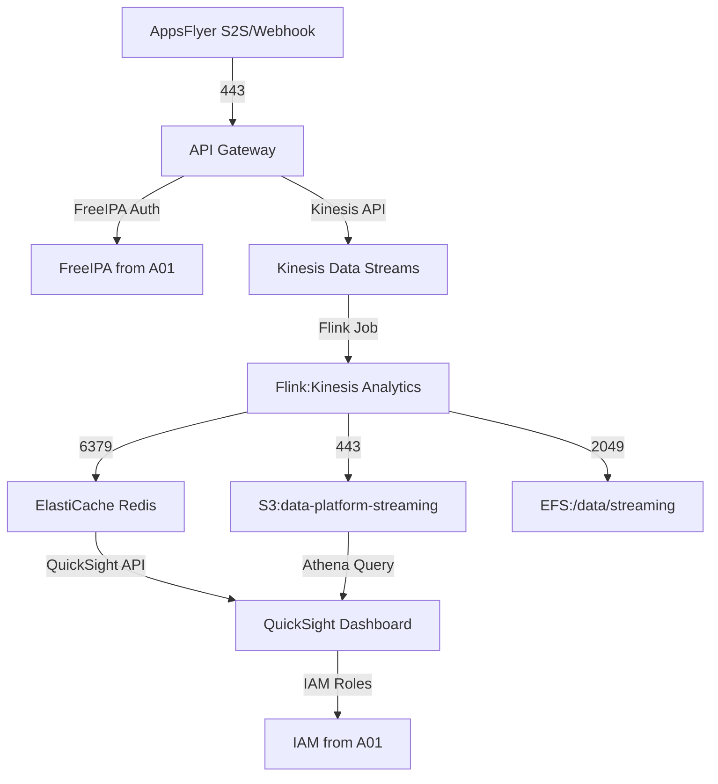

# Real-Time Streaming Data Pipeline

---

## Task Overview

<details>
<summary>Objectives and Scope of Real-Time Data Processing Pipeline</summary>

---

- **Purpose**: Design a streaming data pipeline to ingest AppsFlyer data in real-time, process through multiple aggregation layers, and deliver insights to business dashboards.
- **Scope**: End-to-end flow from AppsFlyer (A04b) through processing to analytics, integrated with A01 AWS Data Platform (VPC, EFS, FreeIPA, IAM).
- **Target Audience**: Data engineers, business analysts, DevOps, and executive stakeholders.
- **Outcome**: A production-ready pipeline with &lt;5 second latency, supporting real-time decision-making.

#### Key Requirements

- **Foundation Dependency**: Leverages A01 infrastructure and A04b AppsFlyer integration.
- **Real-Time Focus**: Continuous streaming, no batch processing.
- **Processing Layers**: Raw events → Hourly aggregations → Daily aggregations.
- **Dashboard Integration**: Feeds QuickSight for real-time business analytics.
- **Scalability**: Handle >100K events/minute (>1M/hour) with linear scaling.

---

#### Success Metrics

- **Latency**: &lt;5 seconds from event to dashboard.
- **Throughput**: >1M events/hour at peak.
- **Reliability**: 99.9% uptime with automatic recovery.
- **Business Impact**: Enables real-time campaign optimization and user behavior insights.

---

</details>

---

## Pipeline Architecture

<details>
<summary>End-to-End Data Flow Design from AppsFlyer to Business Dashboards</summary>

---

- **Architecture Pattern**: Lambda architecture with real-time (Kinesis, Flink) and batch (S3) layers.
- **Data Flow Stages**:
  - **Ingestion**: AppsFlyer S2S API/webhook → API Gateway → Kinesis Data Streams.
  - **Processing**: Apache Flink for real-time transformations and aggregations.
  - **Storage**: S3 data lake (Parquet) and ElastiCache Redis for real-time metrics.
  - **Aggregation**: Hourly (Flink, Redis), daily (S3, Athena).
  - **Dashboard**: QuickSight for business analytics, Grafana for operations.
- **A01 Integration**: Uses A01 VPC, EFS for logs, FreeIPA for authentication, IAM for access control.
- **A04b Integration**: Consumes AppsFlyer raw data via S2S API and webhook.

#### Component Architecture

- **Data Ingestion**:
  - **Kinesis Data Streams**: 10 shards, 1000 records/s/shard, 168-hour retention.
  - **API Gateway**: HTTPS endpoints for AppsFlyer webhooks, authenticated via FreeIPA.
  - **Lambda**: Validates and routes events to Kinesis.
- **Stream Processing**:
  - **Flink (Kinesis Analytics)**: 20 parallel operators, RocksDB for state.
  - **Transformations**: Enrich, clean, aggregate (hourly).
- **Storage**:
  - **S3**: `s3://data-platform-streaming` with date partitions.
  - **Redis**: Real-time metrics (installs, conversions).
- **Dashboard**:
  - QuickSight: S3 (daily), Redis (real-time) datasets.
  - Grafana: Flink/Kinesis metrics.

#### Data Flow Visualization (Mermaid)



---

</details>

---

## Data Ingestion Infrastructure

<details>
<summary>Continuous Streaming from AppsFlyer APIs and Event Processing</summary>

---

- **AppsFlyer Integration**:
  - **S2S API**: Pull raw events (`installs_report`, `in_app_events_report`).
  - **Webhook**: Real-time postbacks for installs, purchases.
- **Event Validation**: Schema checks, deduplication via Redis.
- **Backpressure**: Kinesis auto-scaling, Lambda throttling.
- **Error Handling**: Dead letter queue (SQS) for failed events.

#### Kinesis Data Streams Configuration

- **Stream Setup**:
  ```hcl
  resource "aws_kinesis_stream" "appsflyer_events" {
    name = "appsflyer-events"
    shard_count = 10
    retention_period = 168
    shard_level_metrics = ["IncomingRecords", "OutgoingRecords"]
    tags = { Environment = "data-platform" }
  }
  ```
- **Scaling**: Auto-scale shards if incoming >1000 records/s/shard.
- **Monitoring**: CloudWatch for throughput, errors, consumer lag (`aws kinesis describe-stream`).

#### API Gateway Integration

- **Webhook Endpoint**:
  ```python
  import json, boto3
  def lambda_handler(event, context):
      if not validate_freeipa_token(event['headers']['Authorization']):  # A01 FreeIPA
          return {'statusCode': 401}
      event_data = json.loads(event['body'])
      if not validate_event_schema(event_data):
          sqs_client.send_message(QueueUrl='dlq-url', MessageBody=json.dumps(event_data))
          return {'statusCode': 400}
      kinesis_client.put_record(
          StreamName='appsflyer-events',
          Data=json.dumps(event_data),
          PartitionKey=event_data['app_id']
      )
      return {'statusCode': 200}
  ```
- **Authentication**: FreeIPA LDAP token validation.
- **Rate Limiting**: 10,000 requests/minute.

#### AppsFlyer S2S API

- **Pull Data**:
  ```python
  from appsflyer import AppsFlyerDataExport
  client = AppsFlyerDataExport(api_token='YOUR_TOKEN', app_id='YOUR_APP_ID')
  def ingest_events():
      data = client.export_raw_data(datetime.now() - timedelta(minutes=5), datetime.now())
      kinesis_client = boto3.client('kinesis')
      for record in data['data'].to_dict('records'):
          kinesis_client.put_record(
              StreamName='appsflyer-events',
              Data=json.dumps(record),
              PartitionKey=record['app_id']
          )
  ```

---

</details>

---

## Stream Processing Engine

<details>
<summary>Real-Time Data Transformation and Cleaning Implementation</summary>

---

- **Framework**: Apache Flink on Kinesis Analytics for real-time processing.
- **Transformations**: Enrich (geo, device), clean (deduplicate, validate), aggregate (hourly).
- **State**: RocksDB for fault-tolerant window aggregations.
- **Parallelism**: 20 operators for >100K events/minute.

#### Flink Application

- **Processing Pipeline**:
  ```java
  StreamExecutionEnvironment env = StreamExecutionEnvironment.getExecutionEnvironment();
  DataStream<Event> events = env.addSource(new KinesisSource<>())
      .map(new EnrichmentFunction())
      .filter(new DataQualityFilter())
      .keyBy(Event::getAppId);
  events.timeWindow(Time.hours(1))
      .aggregate(new HourlyAggregator())
      .addSink(new MultiSink(new RedisSink(), new S3Sink()));
  env.execute("AppsFlyer Stream Processor");
  ```
- **Enrichment**:
  ```java
  class EnrichmentFunction implements MapFunction<Event, Event> {
      public Event map(Event event) {
          event.setGeo(getGeoData(event.getIpAddress()));
          event.setDevice(parseUserAgent(event.getUserAgent()));
          return event;
      }
  }
  ```
- **Hourly Aggregator**:
  ```java
  class HourlyAggregator implements AggregateFunction<Event, Aggregate, Aggregate> {
      public Aggregate createAccumulator() { return new Aggregate(); }
      public Aggregate add(Event event, Aggregate acc) {
          acc.installs += event.isInstall() ? 1 : 0;
          acc.revenue += event.getRevenue();
          return acc;
      }
      public Aggregate getResult(Aggregate acc) { return acc; }
      public Aggregate merge(Aggregate a, Aggregate b) {
          a.installs += b.installs;
          a.revenue += b.revenue;
          return a;
      }
  }
  ```
- **Error Handling**:
  ```java
  class ErrorSink implements SinkFunction<Event> {
      public void invoke(Event event, Context context) {
          sqsClient.sendMessage("dlq-url", JSON.toString(event));
      }
  }
  ```

#### Daily Aggregations

- **Athena Query**:
  ```sql
  SELECT
      DATE_TRUNC('day', timestamp) as event_date,
      campaign_id, COUNT(*) as installs,
      SUM(CAST(event_properties->>'revenue' AS DECIMAL(10,2))) as revenue
  FROM "data-platform-streaming"
  GROUP BY DATE_TRUNC('day', timestamp), campaign_id;
  ```

---

</details>

---

## Aggregation Layers

<details>
<summary>Detailed Implementation of Hourly and Daily Aggregation Processing</summary>

---

- **Hourly Aggregations**:
  - **Metrics**: Installs, conversions, revenue by campaign/country/device.
  - **Window**: 1-hour tumbling, 5-minute late data allowance.
  - **Output**: Redis (`metrics:hourly:<campaign_id>`), S3 (`s3://data-platform-streaming/hourly`).
  ```json
  {
    "timestamp": "2025-06-27T15:00:00Z",
    "campaign_id": "123",
    "country": "US",
    "installs": 1250,
    "revenue": 445.50
  }
  ```
- **Daily Aggregations**:
  - **Metrics**: Daily active users, retention, ROI.
  - **Schedule**: 02:00 UTC, Athena on S3.
  - **Output**: S3 (`s3://data-platform-streaming/daily`, Parquet).
  ```sql
  SELECT
      campaign_id, COUNT(DISTINCT user_id) as daily_active_users,
      SUM(CASE WHEN event_type = 'install' THEN 1 ELSE 0 END) as installs
  FROM "data-platform-streaming"
  WHERE DATE_TRUNC('day', timestamp) = CURRENT_DATE - INTERVAL '1' DAY
  GROUP BY campaign_id;
  ```

#### Validation

- **Cross-Check**: Compare hourly (Redis) and daily (S3) aggregations.
  ```python
  def validate_aggregations():
      redis_metrics = redis_client.get('metrics:hourly:123')
      s3_metrics = athena_query("SELECT * FROM daily WHERE campaign_id = '123'")
      return redis_metrics['installs'] == s3_metrics['installs']
  ```

---

</details>

---

## Dashboard Integration

<details>
<summary>Business Analytics Tools Integration and Data Visualization Strategy</summary>

---

- **Platform**: QuickSight for business analytics, Grafana for operations.
- **Data Sources**:
  - **Redis**: Real-time metrics (&lt;1 minute refresh).
  - **S3**: Hourly/daily aggregations (Parquet, Athena).
- **Access Control**: IAM roles (`QuickSightRole`) and FreeIPA groups from A01.
- **Visualization**:
  - Executive: KPIs (installs, revenue, ROI).
  - Marketing: Campaign performance, conversion funnels.
  - Operations: Pipeline health, latency.

#### QuickSight Configuration

- **Dataset**:
  ```yaml
  datasets:
    realtime:
      source: redis://redis.dataplatform.local:6379
      refresh: 1 minute
      metrics: [installs, conversions, revenue]
    daily:
      source: s3://data-platform-streaming/daily
      refresh: 1 hour
      query: SELECT * FROM daily WHERE event_date = CURRENT_DATE
  ```
- **Schema (S3)**:
  ```sql
  CREATE EXTERNAL TABLE streaming_data (
      event_id STRING, campaign_id STRING, user_id STRING,
      event_type STRING, timestamp TIMESTAMP, revenue DECIMAL(10,2)
  )
  PARTITIONED BY (event_date DATE)
  STORED AS PARQUET
  LOCATION 's3://data-platform-streaming/';
  ```

#### Dashboard Design

- **Executive**: Line charts for installs/revenue trends, bar charts for campaign ROI.
- **Marketing**: Funnel visualizations, campaign performance tables.
- **Operations**: Latency (&lt;5 seconds), throughput (>1M/hour), error rates.

---

</details>

---

## Infrastructure Deployment

<details>
<summary>Required AWS Services and Configuration Specifications</summary>

---

- **Services**: API Gateway, Kinesis, Flink (Kinesis Analytics), S3, Redis, QuickSight, CloudWatch.
- **A01 Integration**: VPC (10.0.0.0/16), EFS (/data/streaming), FreeIPA, IAM.
- **A04b Integration**: AppsFlyer S2S API and webhook.

#### Terraform Configuration

- **API Gateway**:
  ```hcl
  resource "aws_api_gateway_rest_api" "appsflyer" {
    name = "appsflyer-webhook"
    endpoint_configuration { types = ["REGIONAL"] }
  }
  resource "aws_api_gateway_resource" "events" {
    rest_api_id = aws_api_gateway_rest_api.appsflyer.id
    parent_id   = aws_api_gateway_rest_api.appsflyer.root_resource_id
    path_part   = "events"
  }
  ```
- **Kinesis Analytics**:
  ```hcl
  resource "aws_kinesisanalyticsv2_application" "stream_processor" {
    name = "appsflyer-stream-processor"
    runtime_environment = "FLINK-1_13"
    service_execution_role = aws_iam_role.flink_role.arn
    application_configuration {
      flink_application_configuration {
        parallelism_configuration {
          parallelism = 20
          configuration_type = "CUSTOM"
        }
      }
    }
  }
  ```
- **Redis**:
  ```hcl
  resource "aws_elasticache_cluster" "redis" {
    cluster_id = "appsflyer-redis"
    engine = "redis"
    node_type = "cache.t3.medium"
    num_cache_nodes = 1
    subnet_group_name = aws_elasticache_subnet_group.redis.name
    security_group_ids = [aws_security_group.redis.id]
  }
  ```
- **IAM Role**:
  ```hcl
  resource "aws_iam_role" "flink_role" {
    name = "FlinkExecutionRole"
    assume_role_policy = jsonencode({
      Version = "2012-10-17"
      Statement = [{
        Effect = "Allow"
        Principal = { Service = "kinesisanalytics.amazonaws.com" }
        Action = "sts:AssumeRole"
      }]
    })
  }
  resource "aws_iam_role_policy" "flink_policy" {
    role = aws_iam_role.flink_role.id
    policy = jsonencode({
      Statement = [
        { Effect = "Allow", Action = ["kinesis:*", "s3:*", "elasticache:*"], Resource = "*" },
        { Effect = "Allow", Action = "cloudwatch:PutMetricData", Resource = "*" }
      ]
    })
  }
  ```

#### Ansible Playbook

- **Flink Setup**:
  ```yaml
  - hosts: flink_nodes
    become: true
    tasks:
      - name: Install Flink
        unarchive:
          src: https://archive.apache.org/dist/flink/flink-1.13.6/flink-1.13.6-bin-scala_2.12.tgz
          dest: /opt
          remote_src: yes
      - name: Configure Flink
        template:
          src: flink-conf.yaml.j2
          dest: /opt/flink-1.13.6/conf/flink-conf.yaml
  ```

#### Cost Management

- Kinesis: $0.015/shard/hour, ~$108/month for 10 shards.
- Flink: $0.11/parallelism-unit/hour, ~$1584/month for 20 units.
- S3/Redis: ~$50/month.
- Total: ~$1800/month, optimized with spot instances.

---

</details>

---

## Monitoring and Alerting

<details>
<summary>Pipeline Health Tracking and Performance Metrics Implementation</summary>

---

- **Monitoring Stack**: CloudWatch, Grafana, QuickSight.
- **Metrics**:
  - Latency: &lt;5 seconds (`StreamingPipeline/ProcessingLatency`).
  - Throughput: >1M events/hour (`Kinesis/IncomingRecords`).
  - Uptime: 99.9% (`Pipeline/Availability`).
- **Alerts**: SNS for latency >5s, throughput drops, errors.

#### CloudWatch Metrics

- **Latency Test**:
  ```python
  import boto3, time
  cloudwatch = boto3.client('cloudwatch')
  def measure_latency():
      start = time.time()
      kinesis_client.put_record(StreamName='appsflyer-events', Data='test', PartitionKey='test')
      while not redis_client.exists('metrics:test'):
          time.sleep(0.1)
      latency = time.time() - start
      cloudwatch.put_metric_data(
          Namespace='StreamingPipeline',
          MetricData=[{'MetricName': 'ProcessingLatency', 'Value': latency, 'Unit': 'Seconds'}]
      )
      return latency < 5
  ```

#### Alerts

- **SNS Configuration**:
  ```bash
  aws sns publish --topic-arn arn:aws:sns:us-east-1:<account>:pipeline-alerts \
      --message "Latency >5s detected"
  ```
- **Channels**: Email, Slack, PagerDuty.

---

</details>

---

## Quality Checklist

<details>
<summary>Compliance with Documentation Standards</summary>

---

- [x] YAML front matter with `report_a05` title.
- [x] Each subsection (###) contains one details block.
- [x] Main sections (##) separated by `---`.
- [x] No separators between ### sections.
- [x] Details blocks start/end with `---`.
- [x] Subsubsections (####) separated by `---`.
- [x] Summary text descriptive and specific.
- [x] Content formatted as bullet points.
- [x] Code blocks indented by 2 spaces with language specification.
- [x] No numbered headings or bullet points.
- [x] Technical symbols in backticks (e.g., `>100K`).

---

</details>

---